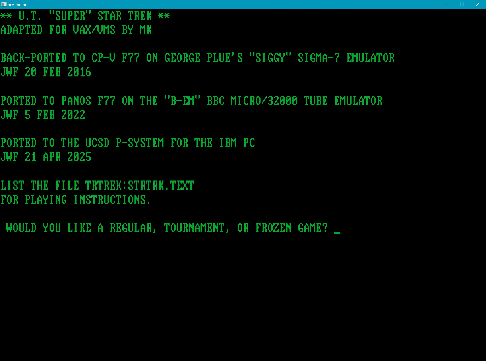
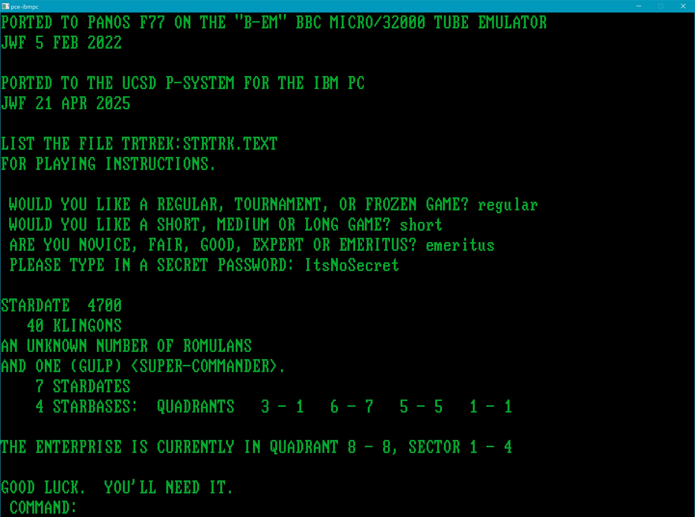
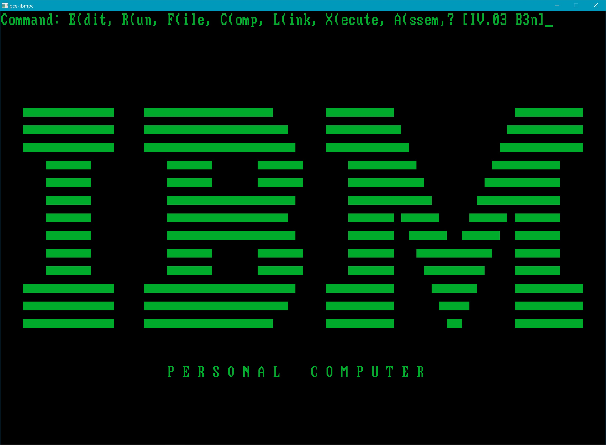
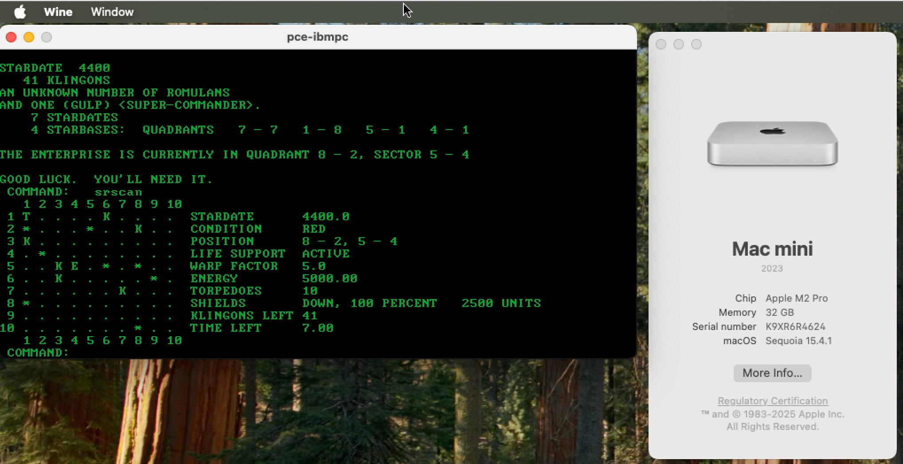

## Description

This repository contains a port of the "Super Star Trek" text-based computer game, a "deluxe" spin-off of Mike Mayfield's original BASIC game that was first implemented in CDC 6600 Fortran at the University of Texas and was later ported to the DEC VAX. The version here is the result of a quixotic (but ultimately successful) experiment to see if the VAX code could be ported to the Fortran 77 version of the UCSD p-System running on an emulator of the original IBM PC (Model 5150). For a bit more history, see "History" below.

## Installation

You'll need to download the latest version of Hampa Hug's PCE emulator for the Model 5150 (as of this writing, the latest one is pce-20250420-cc0c583c-ibm-pc-pcdos-1.00.zip (2025-04-21 05:14) at http://www.hampa.ch/pub/pce/pre/pce-20250420-cc0c583c/machines/ . Note: this is a Windows-based emulator. Extract this archive into a directory (e.g., "D:\PCE").

Copy the original configuration file "D:\PCE\pce-5150.cfg" to "D:\PCE\pce-trek.cfg", then edit "D:\PCE\pce-trek.cfg" making the following changes:

####
    original value:  cfg.pcex              ?= false
                     ---
    new value:       cfg.pcex              ?= true

                     cfg.ram               ?= 64K
                     ---
                     cfg.ram               ?= 128K

                     cfg.bios              ?= "ibm-pc-1981-04-24.rom"
                     #cfg.bios             ?= "ibm-pc-1981-10-19.rom"
                     #cfg.bios             ?= "ibm-pc-1982-10-27.rom"
                     ---
                     #cfg.bios             ?= "ibm-pc-1981-04-24.rom"
                     #cfg.bios             ?= "ibm-pc-1981-10-19.rom"
                     cfg.bios              ?= "ibm-pc-1982-10-27.rom"

                     include "data/pce-ibmpc.inc"
                     ---
                     include "data/pce-trek.inc"

Setting cfg.pcex to "true" causes PCE to apply some sort of custom BIOS patch. The details of this are elusive, but whatever it does, the p-System absolutely will not run without it.

The change to cfg.ram allows the p-System to take advantage of 128KB of memory: 64KB for heap and stack, and 64KB for an "external code pool". The p-System's SETUP program ("SETUP.CODE" on the UTILITY distribution floppy) has been run to change SYSTEM.MISCINFO on the boot disk to use the extra 64KB for the external code pool.

The change to cfg.bios is to make sure the ROM is supporting double-sided (8 sector/track, 320KB) floppy disks, a feature which was added during 1982. (The BASIC ROM specified by cfg.basic is irrelevant here and doesn't need to be changed.)

The last change above specifies a custom "include file", coming up next.

Copy the original configuration include file "D:\PCE\data\pce-ibmpc.inc" to "D:\PCE\data\pce-trek.inc".

NOTE: Some of the configuration variables appearing in the D:\PCE\\\*.inc include file are repetitions of those in the corresponding D:\PCE\\\*.cfg file (pce-trek.cfg or pce-5150.cfg) -- e.g., cfg.speed and cfg.ram; but if I understand the "?=" syntax correctly, the include file values only take effect if the variable was not previously set in the \*.cfg file. "cfg.fdd ?= 2" (the number of floppy disk drives) in \*.inc is pre-empted by "cfg.fdd ?= 4" in D:\PCE\\\*.cfg.

Edit "D:\PCE\data\pce-trek.inc" making the following changes to the "Floppy disks" section:

####
    if (cfg.fdd >= 1) {
            disk {
                    drive    = 0x00
                    type     = "image"
                    c        = 40
                    h        = 2
                    s        = 8
                    file     = "TRTREK.ima"
                    optional = 1
                    readonly = 0
            }
    }
    
    if (cfg.fdd >= 2) {
            disk {
                    drive    = 0x01
                    type     = "image"
                    c        = 40
                    h        = 2
                    s        = 8
                    file     = "TREK3A.ima"
                    optional = 1
            }
    }
    
    if (cfg.fdd >= 3) {
            disk {
                    drive    = 0x02
                    type     = "image"
                    c        = 40
                    h        = 2
                    s        = 8
                    file     = "TREK3B.ima"
                    optional = 1
            }
    }
    
    if (cfg.fdd >= 4) {
            disk {
                    drive    = 0x03
                    type     = "image"
                    c        = 40
                    h        = 2
                    s        = 8
                    file     = ""
                    optional = 1
            }
    }

I believe the "cfg.speed ?= 1" line in "D:\PCE\data\\\*.inc" means "attempt to match the speed of a 4.77 MHz 8088 processor". However, the corresponding line in the D:\PCE\\\*.cfg file is "cfg.speed ?= cfg.pcex ? 0 : 1" which (again, if I understand the syntax correctly) means that if cfg.pcex is "true" (which is is), then cfg.speed will be set to 0. I would **guess** that the speed setting 0 means "run as fast as possible" rather than "try to accurately match the speed of a real IBM PC".

The value "cfg.ems" seems to provide support for a **DOS** "expanded memory" driver. However, "Extended Memory" in the p-System documentation (also called the "Memory Expansion Option") refers to an optional 32KB or 64KB memory expansion card originally offered by IBM to supplement the 64KB on the IBM PC motherboard. We have already set cfg.ram to 128K, and made the SETUP change to SYSTEM.MISCINFO. So I think cfg.ems can remain 0 (disabled).

The line "cfg.fdc.accurate ?= false" in D:\PCE\data\\\*.inc is pre-empted by the line "cfg.fdc.accurate ?= (cfg.speed == 1)" in D:\PCE\\\*.cfg, and since cfg.pcex being "true" has caused cfg.speed to be 0, cfg.fdc.accurate has already been set to "false".

Another floppy-disk-related variable in D:\PCE\\\*.cfg is set by "cfg.fdc.drives ?= cfg.pcex ? 0 : 4" which would seem to indicate that this variable's value is 0, pre-empting the line in D:\PCE\data\\\*.inc "cfg.fdc.drives ?= 4". Note that this "cfg.fdc.drives" variable is independent of "cfg.fdd", which is the "real" number of floppy drives. In any case, "cfg.fdc.drives" seems to have no effect whatsoever.

The following change to "D:\PCE\data\pce-trek.inc" is purely cosmetic and optional. It affects the size of the PCE screen, and depends on personal preference and the size of your monitor (in my case, I have to hide the Windows taskbar to make it fit).

####
    original value:  cfg.scale             ?= 1
                     ---
    new value:       cfg.scale             ?= 2

Copy the original batch startup file "D:\PCE\run-mda.bat" to "D:\PCE\run-trek.bat", then edit "D:\PCE\run-trek.bat" making the following change:

####
    original value:  bin\pce-ibmpc.exe -v -c pce-5150.cfg -l pce.log -g mda -r
                     ---
    new value:       bin\pce-ibmpc.exe -v -c pce-trek.cfg -l pce.log -g mda -r

Finally, copy the three disk images "TRTREK.ima", "TREK3A.ima" and "TREK3B.ima" from this repository's "disk_images" subdirectory to your "D:\PCE" (or equivalent) Windows directory.

## Starting and running the "Super Star Trek" game

Just double-click the D:\PCE\run-trek.bat file (or run it from a Command Prompt window) to start the game.

Answer the initial questions, and then play the game! Detailed instructions are in the file STRTRK.TEXT (resident on the p-System boot disk TRTREK: and also in the "source" subdirectory below). You can use the p-System "F(ile)"r (after exiting the game; see below) to "T(rans"fer the instructions to the "CONSOLE:" or the "PRINTER:", but it's probably easier to read the instructions outside of the p-System itself.

NOTE: If you mouse-click inside the PCE window, your mouse will be "captured" by PCE. To release it, click the "middle" mouse button (i.e., the scroll wheel, usually). PCE may "fight" you on this -- it can take several tries to get the mouse back, and be able to select/move the PCE window itself via its title bar, etc.

## Some tips

1. About "TOURNAMENT" games: The idea behind a "tournament" game is that the name or number you type in, to identify the tournament, is then used to seed a random number generator, resulting in an identical sequence of pseudo-random numbers, in turn resulting in identical games for identical actions. So it provides a level playing field for people to compete against each other -- the chance element is held constant. The calls to RANF(0) in the original VAX code are mapped to calls to RANF() in the Pascal "UNIT RANDOM" in TRRANF.PAS.TEXT (it is possible to call Pascal from Fortran; we do it here and in one other "unit" to get the system date). For a "REGULAR" game, the seed is set (CALL RANSET(0) to a subroutine also in TRRANF.PAS.TEXT) from a "system call" to TIME() in the Pascal runtime library. For a "TOURNAMENT" game, the seed is provided by the user. NOTE: If you use an alphanumeric string as your tournament name (i.e., anything starting with a letter), then all the characters on a single line are significant (their ASCII values are simply summed to provide the seed). If you use all numbers, they get converted to floating-point and then truncated to integer to form the seed. Integers in the p-System comprise a single 16-bit "word", so anything in the range 1..32767 will be a unique "tournament number" seeding a unique sequence of pseudo-random numbers. A negative number is converted to its absolute value; leading 0's are ignored. The first occurrence of a letter in a string of digits terminates the number at the digit before it.

2. About "FROZEN" games: You can use the command "FREEZE" to save the current state of an in-progress game to a file and exit the current game (but not the program). You'll then get the "ENTER FILE NAME:" prompt; just typing the Return key at this point results in the "GAME NOT FROZEN." message followed by the reappearance of the "COMMAND:" prompt. The "freeze file" created contains data about the current state of the game. It gets ".TRK" automatically appended to a user-selected name, which is significant to 8 characters (not including the .TRK extension), and should be an alphanumeric string which must start with a letter (anything not starting with a letter is rejected; any characters typed beyond the allowed length are ignored; non-alphanumeric characters after the initial letter may be accepted, ignored, or result in a file with an unexpected name). After the "FREEZE" command is executed, you'll get the "DO YOU WANT TO PLAY AGAIN?" prompt. The game can be resumed then or at any later time by selecting "FROZEN" as the response to the initial question about the type of game wanted, and responding to the "ENTER FILE NAME:" prompt. The file name typed should omit the ".TRK" appended extension -- that's added automatically.

WARNING: If the freeze file doesn't exist, you'll get the following message:

####
    IO error: file not found
    Segment RTIO     Proc# 28    Offset# 111
    Type <space> to continue

After you type the \<space\>, you'll get the p-System command menu at the top of the screen:

####
    Command: E(dit, R(un, F(ile, C(omp, L(ink, X(exute, A(ssem, ? [IV.03 B3n]
    System re-initialized

Type "i" at this point to automatically re-start the game (via the SYSTEM.STARTUP file).

Alas, there seems to be no way from the p-System's Fortran 77 to find out in advance whether a file exists before trying to open it, and no way to catch the error (e.g., via an ERR=<label> option in the OPEN statement, as in the VAX Fortran code). You might think this could be done from Pascal (as with the other two Pascal units used here), but the Fortran manual sternly warns against attempting to do anything involving an I/O operation in a Pascal unit called from Fortran. So if you type the name of a freeze file that doesn't exist, you'll get the runtime error and the system will "reboot" -- a minor annoyance.

NOTE: The TRTREK.ima boot disk containing the game does **not** contain the "E(dit"or (SYSTEM.EDITOR) or the "C(omp"iler (SYSTEM.COMPILER). It does contain the "F(ile)"r (and, of course, SYSTEM.LIBRARY, which is actually the Fortran runtime library FORTLIB2.CODE from the FORTRAN distribution floppy; and PASCAL.LIBRARY, which is actually the Pascal runtime library SYSTEM.LIBRARY from the SYSTEM2 distribution floppy; both runtimes are needed to support the game). Also, you'll notice we're using the "2-word-real" as opposed to the "4-word-real" versions of the p-System code -- i.e., 32-bit floats rather than 64-bit floats; high-precision floating point is not needed here.

NOTE: Disk space is at a premium in this system. Do not allow freeze files to accumulate on the TRTREK: volume (TRTREK.ima floppy image). Go into the Command Menu (by terminating the game or provoking a run-time error) and check for and remove any unneeded freeze files:

####
    (From the Command Menu perform Filer,List by typing "fl":)
    Dir listing of what vol ? TRTREK:
    Filer: G(et, S(ave, W(hat, N(ew, L(dir, R(em, C(hng, T(rans, D(ate,? [C.11]
    TRTREK:
    SYSTEM.PASCAL      121   9-Jan-82
    SYSTEM.INTERP       27   9-Mar-82
    . . .
    TRTREK.TEXT        114  25-Apr-25
    MYGAME.TRK           8  12-Apr-25
    13/13 files<listed/in-dir>, 417 blocks used, 223 unused, 121 in largest
    (Now perform Remove by typing "r":)
    Remove what file ? MYGAME.TRK
    TRTREK:MYGAME.TRK        --> removed
    Update directory ? y

3. About the "EMEXIT" Emergency Exit command: This performs an automatic "freeze" of the game to a file named EMSAVE.TRK (any previously-existing file of that name is overwritten), and then the program itself (not just the current game) is exited. Before exiting, the screen is "cleared" by emitting 24 blank lines. The game can later be resumed as with any FROZEN game, by selecting "EMSAVE" as the "freeze file" name (do NOT type the ".TRK"!). This facility was presumably provided to enable a quick exit in case the boss was about to make an appearance.

4. Getting a list of commands: If you type "?" at the "COMMAND:" prompt, you'll get a list of legal commands (this is true if you type anything that's not recognized as a command, as indicated by the "UNRECOGNIZED COMMAND" message). Do **not** type "HELP"! ("HELP" is a long-range transporter command to get out of a tight spot; it can save or destroy the ship.) Most commands can be abbreviated, but a few (TERMINATE, FREEZE, DESTRUCT, DEATHRAY, HELP) must be typed in full in order to be recognized.

5. Unfortunately, the PCE window does not scroll. If there is heavy output from the game, it is possible you'll lose some of it off the top of the screen. (PCE does recognize Ctrl-S as a control-flow character -- Ctrl-S both stops and resumes output -- but this is hardly a practical solution to the scrolling problem.)

6. Exiting the program: TERMINATE and EMEXIT are the "official" ways to get out. The latter is quick and final (but leaves a freeze file on the boot disk); the former makes you jump through a few hoops.

7. The source file TRDEBU.F77.TEXT is an addition to the original VAX complement, and was created in order to add some commands that facilitated testing the game without actually being able to play it very well. In particular, the "DEBUG" command was a generic command that could be attached to any subroutine that needed to be tested. In its final state, it calls the subroutine that generates a commemorative plaque (see the file "plaque.dat" in the "source/original_VAX_code" directory), which is sent to the "lineprinter" (the PRINTER: device in the p-System). Similarly, if you answer "y" to the question "DO YOU WANT A COPY OF YOUR SCORE ON THE LINE PRINTER?" when terminating a game, your final score will be sent to PRINTER: as well as appearing in the PCE window (CONSOLE:).

####
    (To see disks and other devices on-line, from the Command Menu
     perform Filer,Vols by typing "fv":)
    Vols on-line:
      1   CONSOLE:
      1   SYSTERM:
      4 # TRTREK:
      5 # TREK3A:
      6   PRINTER:
      7   REMIN:
      8   REMOUT:
      9 # TREK3B:
    Root vol is - TRTREK:
    Prefix is   - TRTREK:

NOTE: "lineprinter" output from PCE is sent to the "parallel port" file "D:\PCE\par1.out" (or "par1.out" in whatever directory you've installed PCE into). This file is created automatically by PCE when it starts up if it doesn't exist already. Additional lineprinter output is appended to par1.out (rather than simply overwriting the existing file).

Similarly, REMIN: and REMOUT: are the "serial port", directed from/to file "D:\PCE\ser1.out" (also automatically created). Alas, REMIN: is not a reliable way to get data into the p-System on PCE. "T(rans"ferring (via the Filer) to REMOUT: can get data out, but it's very slow.

Neither PRINTER: nor REMOUT: transfer data perfectly cleanly to par1.out/ser1.out -- there can be NULs interspersed with legitimate data, particularly with REMOUT:/ser1.out. PRINTER:/par1.out limit that "garbage" to the beginning and end of the transferred data, as well as being faster.

## History

In early 2016, source code for a 70s-era Star Trek text-based game turned up on the Web site of one Oleg Uryutin, who had been a student in the early 80s at the Minsk Radiotechnical Institute and had fond memories of discovering a PDP-11 version of Star Trek and who, with the help of a colleague there, had ported the game from RT-11 to RSX-11M on the PDP-11. His site (which is now, alas, defunct and not even archived on the Wayback Machine) had the source for a VAX Fortran version of the University of Texas "Super Star Trek". In early 2016, I conceived the idea of trying to port the game to a Xerox Sigma/CP-V emulator (that port is now available on GitHub as part of the "software kit" for a SimH version of the Sigma: https://github.com/kenrector/sigma-cpv-kit/tree/main/games/Super_Star_trek_(FORTRAN) .

Some years later, I ported the game to the BBC Micro emulator "b-em" (also emulating the National Semiconductor 32000 "Tube" co-processor) running the Acorn "Panos" operating system: https://github.com/hoglet67/Panos_Trek .

Several years ago, I had stumbled across the Fortran 77 version of the p-System for the IBM PC at https://bitsavers.org/bits/IBM/PC/p-system/p-system_rel_1.zip (an inobvious place: not under https://bitsavers.org/bits/UCSD_Pascal/ **or** under https://bitsavers.org/bits/Softech/ !), which complemented an even earlier (but much "abridged") set of p-System distribution disk images I had found linked to in a post on a forum called "Mike's PCjr Page" (which apparently originally came from the private Yahoo "UCSDPascal" group). The Fortran version on Bitsavers is a Fortran **only** distribution -- it lacks the Pascal compilers (though it has the Pascal runtime libraries). (Only after completing this project did I discover that the Yahoo files are still available from http://pascal.hansotten.com/ucsd-p-system/ucsd-yahoo-group/ . The "Yahoo files archive" links to "pascal.hanshotten.com/uploads/ucsd/yahoo/files.zip". The Zip file contains, under "Disk images/IBM PC", FORTRAN.IMD, PASCAL.IMD AND SYSTEM2.IMD .)

So recently, I started wondering how far I could get with "Super Star Trek" and the p-System version of Fortran 77. As it turned out, I needed **both** a Fortran compiler and a Pascal compiler for this project, so it's fortunate I had stashed away the Yahoo floppy images I'd grabbed from "Mike's PCjr" forum back in 2016, though that archive **only** had the SYSTEM2 and PASCAL disk images, whereas the Bitsavers archive has SYSTEM2, SYSTEM4, FORTRAN, UTILITY, EXTRAS, and STARTUP. The "2" and "4" refer to the size of floating-point numbers -- either 2 (16-bit) "words" (32 bit real) or 4 words (64 bit real). The compilers don't initially reside on the distribution boot (SYSTEMn) disks, which contain only the Pascal runtime library (either 2- or 4-word-real version, corresponding to SYSTEM2 or SYSTEM4) and have to be "installed" from either FORTRAN (which contains both 2- and 4-word-real flavors of both the Fortran compiler and the Fortran runtime) or PASCAL (which contains 2- and 4-word-real flavors of the compiler; the Pascal runtime matches the n=2 or n=4 designation of the SYSTEMn boot disk). Both the "Mike's PCjr" and Bitsavers sets of distribution disks, by the way, display the same p-System version number: "IV.03 B3n".

The unmodified VAX source code, along with VMS command files to build the executable, are included here in the directory "source/original_VAX_code", for reference. (The VAX code builds and runs without a hitch on a SimH VAX-11/780 running VMS 4.7 and VAX Fortran V4.8-276. The top-level build command is "@TREKBLD".)

## Quitting the p-System cleanly

The "official" way to do this is to type "H(alt" from the Command Menu. You can then just close the PCE window. I have not, however, ever experienced any disk corruption from just closing the PCE window with the p-System running.

## A final warning

The game seems to be more-or-less stable and usable in the p-System environment. However, I make no guarantee of this! If you're a "serious" player, and discover that the game crashes or hangs after you've spent an edge-of-seat hour pursuing Klingons, I'm sorry, but ¯\\_(ツ)_/¯ . If you want guaranteed reliability, run the VAX code (see above) on a SimH VAX (or, indeed, find a more modern version of the game).

This effort was undertaken as an exercise in fairly intensive use of the p-System, and "Super Star Trek" clearly pushes the IBM PC version of the p-System to the limits of (or slightly beyond!) its capabilities. For one thing, getting **four** floppies installed on original IBM PC hardware would not have been practical. See the README.md in the "source" subdirectory for more about actually building the game (including creating 640-block "double-sided" floppy images from the original 320-block p-System distribution disks, configuring the 64KB "Memory Expansion Option" (p-System "Extended Memory") to be able to use an "external code pool", separate compilation, code segments and memory management in the p-System, etc.

Hint: If you want to play multiple games in a row, you might get better long-term stability by answering the question "DO YOU WANT TO PLAY AGAIN?" with 'n' and then re-initializing the p-System from the Command Menu by typing "i" (the game will then start again from TRTREK:SYSTEM.STARTUP, just as when you booted the first time).

## Enjoy!

"Super Star Trek" running on the UCSD p-System on the PCE IBM 5150 emulator on an ARM-based Mac Mini, via Wine 10.0 and the Rosetta 2 x86-to-ARM translator:

