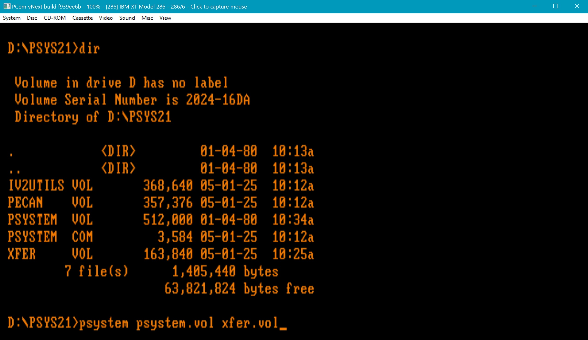
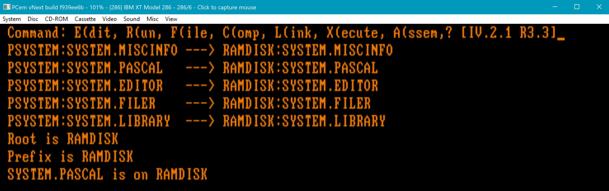
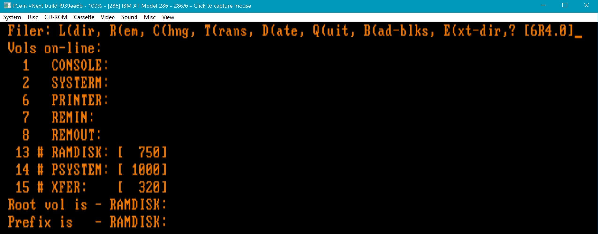
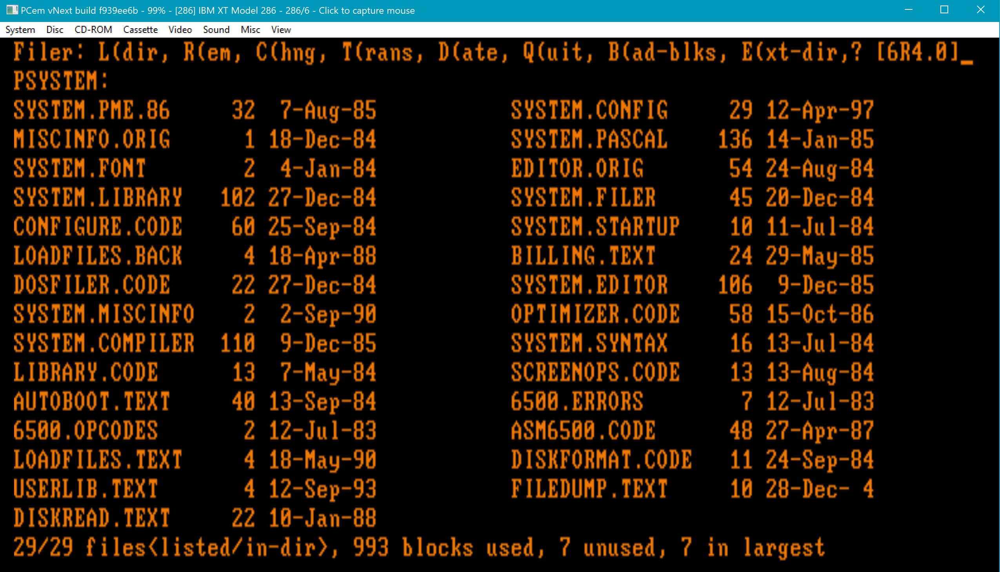
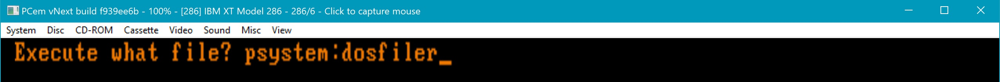
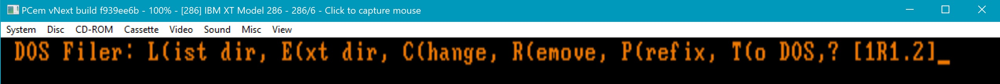
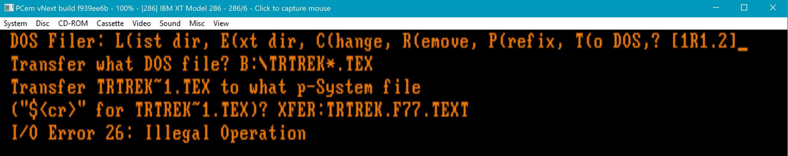
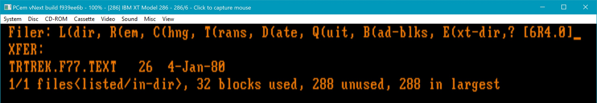
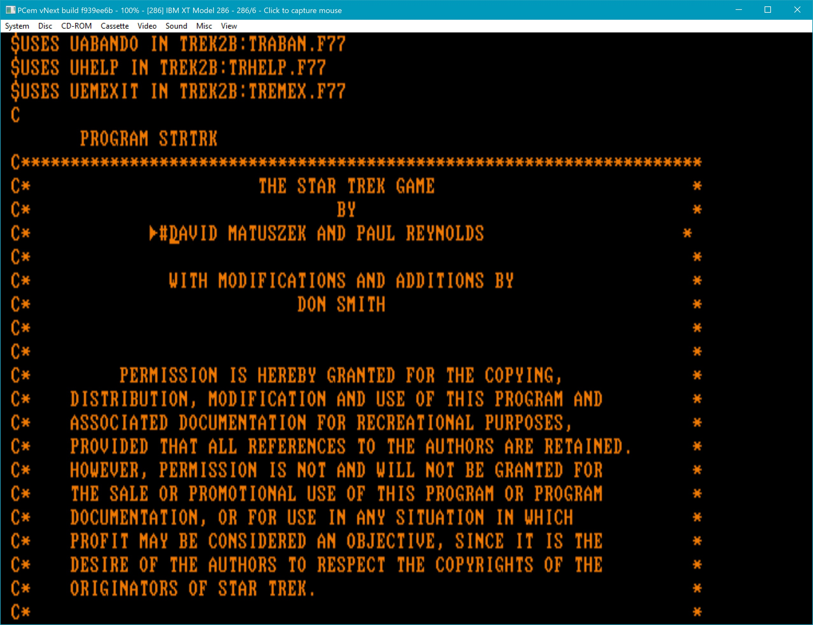
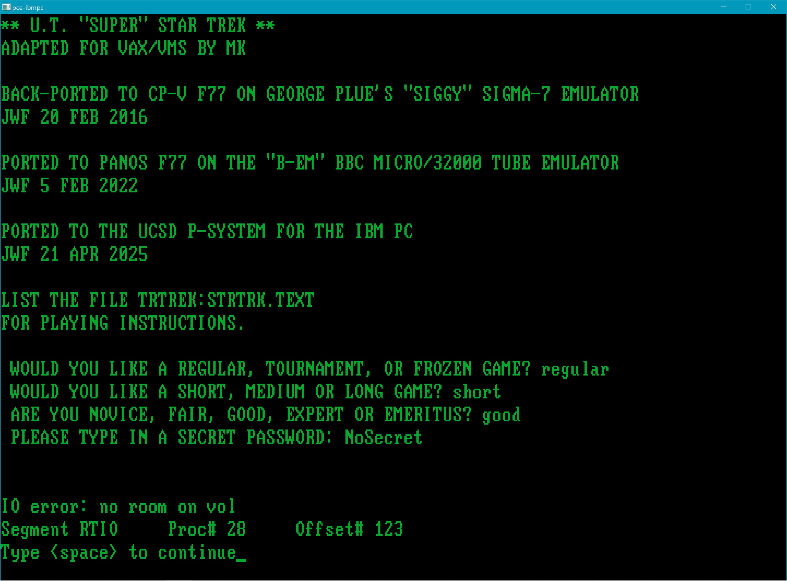

## Preparing the UCSD p-System disk images

The Bitsavers Fortran-only p-System distribution floppy images (as well as the Pascal-only images from Yahoo) are \*.IMD floppy image files that had originally been archived using Dave Dunfield's ImageDisk program. I have converted these into "raw" floppy images using both Simon Owen's command-line disk image utility SAMdisk ( http://simonowen.com/samdisk/ ) and more recently (and more conveniently) using the software that accompanies the "HxC Floppy Emulator" ("HxCFloppyEmulator_soft.zip" downloadable from https://hxc2001.com/download/floppy_drive_emulator/ ). The latter archive contains a (Windows) graphical program "HxCFloppyEmulator.exe". From the HxCFloppyEmulator main window, click the "Load" button at the top of the column of buttons at the left side of the window (labelled "Load a floppy file image"). Then navigate to and select the \*.IMD file you want to convert. Then click the "Export" button (5th button down, labelled "Export/save the loaded file image"), and in the "Save as type" drop-down, choose the 5th selection "IMG file (RAW sector file format) (\*.img)". The extension ".img" is the default, but you can change this to whatever you like (I use ".ima" for my raw disk image files).

## Increasing the size of the floppy images

The p-System distribution disks from IBM were single-sided 5 1/4 inch 160KB floppy disks (with 40 tracks or "cylinders", 8 sectors per track, containing a total of 320 512-byte blocks). This was the smallest-capacity floppy disk format ever supported by the IBM PC, and was the only floppy format available at its introduction in 1981. In 1982, BIOS and DOS changes added support for double-sided 320KB floppies (40 tracks, 8 sectors per track, totalling 640 512-byte blocks). Later versions of DOS supported 9 sector-per-track disks (180KB single-sided or 360KB double-sided).

My first experiment was to see if I could create larger floppy images (whether bootable or not) that would work properly with the p-System. You can create "blank" disk images of any size using the "dd" utility in Linux (or on Windows using WSL, Msys2, Cygwin, etc.), e.g.:

####
    $ dd if=/dev/zero of=SSVOL.ima bs=512 count=320
    320+0 records in
    320+0 records out
    163840 bytes (164 kB, 160 KiB) copied, 0.0052726 s, 31.1 MB/s

    $ dd if=/dev/zero of=DSVOL.ima bs=512 count=640
    640+0 records in
    640+0 records out
    327680 bytes (328 kB, 320 KiB) copied, 0.0066677 s, 49.1 MB/s

A blank image created as above can be attached to the PCE emulator via the D:\PCE\data\pce-trek.inc configuration include file (or D:\PCE\data\pce-ibmpc.inc or its equivalent location and name in your PCE installation) as a disk of type "image" and with the appropriate c[ylinder], h[ead], and s[ector] parameters (notice that the "head" parameter is either h=1 for a single-sided 160KB image or h=2 for a double-sided 320KB image):

####
    if (cfg.fdd >= 3) {
            disk {
                    drive    = 0x02
                    type     = "image"
                    c        = 40
                    h        = 1
                    s        = 8
                    file     = "SSVOL.ima"
                    optional = 1
            }
    }
    
    if (cfg.fdd >= 4) {
            disk {
                    drive    = 0x03
                    type     = "image"
                    c        = 40
                    h        = 2
                    s        = 8
                    file     = "DSVOL.ima"
                    optional = 1
            }
    }

The p-System does come with a low-level disk formatting utility (DISKFORMAT.CODE on the UTILITY disk), but this cannot be used with emulated floppy images, and is not needed in any case. The "F(ile"r on the Command Menu has a "Z(ero" sub-command, which places directory information and a volume label on a blank disk (more-or-less equivalent to "mkfs" in Unix/Linux).

Floppy "volumes" can be specified to the p-System Filer by a volume number as well as, or instead of, a volume name. Floppy positions 1, 2, 3, and 4 in the PCE configuration file are known to the Filer as volumes #4, #5, #9, and #10, respectively. Volume #4 is always the boot disk (and therfore must be bootable; floppies in other positions may or may not be bootable). So the disk images SSVOL.ima and DSVOL.ima in the above D:\PCE\data\\*.inc configuration include file excerpt will be accessible from the p-System Filer as volumes #9 and #10 respectively.

An entirely blank disk created by "dd" as above will not initially show up as being "on-line" in the Filer. So, for instance, if you have PCE configured with SYSTEM2.ima in floppy "drive" 1, nothing in floppy drive 2, blank SSVOL.ima in floppy drive 3 (h=1 !), and blank DSVOL.ima in floppy drive 4 (h=2 !), the Filer will initially show (in response to the "V(ols" sub-command):

####
    Filer: G(et, S(ave, W(hat, N(ew, L(dir, R(em, C(hng, T(rans, D(ate,? [C.11]
    Vols on-line:
      1   CONSOLE:
      2   SYSTERM:
      4 # SYSTEM2:
      6   PRINTER:
      7   REMIN:
      8   REMOUT:
    Root vol is - SYSTEM2:
    Prefix is   - SYSTEM2:

However, #9 and #10 are still "there" (provided they've been mounted correctly in the PCE configuration file).

So, you can use the "Z(ero" sub-command by specifying a volume number:

####
    Zero dir of what vol ? #9
    Duplicate dir ? n
    # of blocks on the disk ? 320
    New vol name ? SSVOL
    SSVOL: correct ? y
    SSVOL: zeroed

    Zero dir of what vol ? #10
    Duplicate dir? n
    # of blocks on the disk ? 640
    New vol name ? DSVOL
    DSVOL: correct ? y
    DSVOL: zeroed

"Duplicate dir" is a file recovery feature  unneeded in these days of easily-backed-up disk images.

In the Filer, the "V(ols" sub-command now shows:

####
    Filer: G(et, S(ave, W(hat, N(ew, L(dir, R(em, C(hng, T(rans, D(ate,? [C.11]
    Vols on-line:
      1   CONSOLE:
      2   SYSTERM:
      4 # SYSTEM2:
      6   PRINTER:
      7   REMIN:
      8   REMOUT:
      9 # SSVOL:
     10 # DSVOL:
    Root vol is - SYSTEM2:
    Prefix is   - SYSTEM2:
 
In the Filer, the "L(dir" sub-command for each of the two empty disks shows:

####
    Dir listing of what vol ? SSVOL:
    Filer: G(et, S(ave, W(hat, N(ew, L(dir, R(em, C(hng, T(rans, D(ate,? [C.11]
    SSVOL:
    0/0 files<listed/in-dir>, 6 blocks used, 314 unused, 314 in largest

    Dir listing of what vol ? DSVOL:
    Filer: G(et, S(ave, W(hat, N(ew, L(dir, R(em, C(hng, T(rans, D(ate,? [C.11]
    DSVOL:
    0/0 files<listed/in-dir>, 6 blocks used, 634 unused, 634 in largest

Note: the ":" at the end of the volume name is **required** with the "L(dir" sub-command; it was optional (i.e., provided automatically if absent) with the "Z(ero" sub-command.

Warning: It is possible to create and attach (in PCE) "custom" disk sizes, such as a 640KB (1280 block) floppy with c/h/s = 80/2/8. The Filer will even initialize ("Z(ero") such a disk and report 640KB as being available. However, attempting to "T(rans"fer (copy) files to such a disk will fail at the 640-block (320KB) limit. Another limitation is that both the methods I've discovered to transfer data into the PCE/p-System require using a "single-sided" c/h/s = 40/1/8 160KB floppy image to shuttle files into the emulator (see below).

## Making a larger (640-block) disk bootable

Create (using "dd", as described above), a 640-block (320KB) floppy image (call it, say, DSVOL.ima), attach it to PCE via the D:\PCE\data\\*.inc configuration include file, and initialize it in the p-System (i.e. "Z(ero" it in the "F(ile"r, as described above).

Warning: if you make a syntax error in your D:\PCE\data\\*.inc configuration include file (such as a missing quotation mark around the name of the floppy image file, or an extra quotation mark), PCE won't complain. It simply won't start. Another thing to watch out for is forgetting to change h=2 to h=1 when changing an attached floppy image from "double-sided" (320KB) to "single-sided" (160KB) (or vice versa). Forgetting this can lead to unpleasant results.

Boot from an already-bootable disk (such as the SYSTEM2 distribution disk) and copy system files to the newly-initialized double-sided disk image (DSVOL: in this example). NOTE: at a minimum, SYSTEM.PASCAL, SYSTEM.INTERP, and SYSTEM.MISCINFO are required to boot at all, but you can't do much without SYSTEM.FILER, and you might just as well copy **all** the files from the boot disk to the new disk.

Use "dd" again to strip off the first two (512 byte) blocks from DSVOL: and save the rest:

####
    $ dd if=DSVOL.ima of=remblks bs=512 skip=2
    638+0 records in
    638+0 records out
    326656 bytes (327 kB, 319 KiB) copied, 0.0089242 s, 36.6 MB/s

If you examine the "remblks" file, you should see the following:

####
    $ od -Ad -tx1z remblks | more

    0000000 00 00 06 00 00 00 05 44 53 56 4f 4c 00 00 80 02  >.......DSVOL....<
    0000016 0a 00 f8 02 c4 32 00 00 00 00 06 00 7f 00 05 00  >.....2..........<
    0000032 0d 53 59 53 54 45 4d 2e 50 41 53 43 41 4c 60 f9  >.SYSTEM.PASCAL`.<
    0000048 00 02 91 a4 7f 00 80 00 05 00 0f 53 59 53 54 45  >...........SYSTE<
    0000064 4d 2e 4d 49 53 43 49 4e 46 4f c2 00 91 a4 80 00  >M.MISCINFO......<
    0000080 9b 00 05 00 0d 53 59 53 54 45 4d 2e 49 4e 54 45  >.....SYSTEM.INTE<
    0000096 52 50 60 f9 00 02 93 a4 9b 00 bb 00 02 00 0c 53  >RP`............S<
    . . .

This is the beginning of the directory information (and starts with the volume label).

On the other hand, the beginning of DSVOL: itself looks like:

####
    $ od -Ad -tx1z DSVOL.ima | more

    0000000 00 00 00 00 00 00 00 00 00 00 00 00 00 00 00 00  >................<
    *
    0001024 00 00 06 00 00 00 05 44 53 56 4f 4c 00 00 80 02  >.......DSVOL....<
    0001040 0a 00 f8 02 c4 32 00 00 00 00 06 00 7f 00 05 00  >.....2..........<
    0001056 0d 53 59 53 54 45 4d 2e 50 41 53 43 41 4c 60 f9  >.SYSTEM.PASCAL`.<

Those first 1024 bytes (two 512-byte blocks) are where the boot blocks are going to go.

Using "dd" one more time, save the first two blocks from an already-bootable floppy image file (such as the SYSTEM2 distribution disk):

####
    $ dd if=SYSTEM2.ima of=bootblks bs=512 count=2
    2+0 records in
    2+0 records out
    1024 bytes (1.0 kB, 1.0 KiB) copied, 0.004026 s, 254 kB/s

Finally, concatenate the two outputs from "dd" above to get a double-sized (640-block, 320KB) p-System boot disk:

####
    $ cat bootblks remblks >DSVOL_BOOT.ima

You can now attach this to PCE via your D:\PCE\data\\*.inc configuration include file as floppy disk #1 (don't forget to set h=2 !). Also, **detach** the original DSVOL.ima file if it's still attached to PCE (you can just set file="" for that floppy). The p-System can become confused if it "sees" two identically-labelled volumes both containing system files.

The above techniques have been used to create several 320KB (640-block "double-sided" disks containing p-System code which are included here. The floppy images in the ../source/build_disk_images subdirectory include (non-bootable) UTILF2.ima, which consolidates the files on the UTIL and EXTRAS distribution disks from the Bitsavers archive, and (bootable) images BOOT2F2.ima containing the (2-word-real) Fortran compiler and runtime library, plus the (2-word-real) Pascal runtime library, LIBRARY.CODE (the object librarian from UTIL), USERLIB.TEXT (listing the runtime libraries required for the game), and a couple of command scripts (LIB3A.TEXT and LIB3B.TEXT) used to create those runtime libraries (TRLIB1.LIBRARY - TRLIB5.LIBRARY on TREK3A: and TRLIB6.LIBRARY on TREK3B:); and BOOT2P2.ima, containing the (2-word-real) Pascal compiler (necessary to compile the two Pascal source files used by the game) and Pascal runtime. The three floppy image files for "normal" game play, in ../disk_images, include TRTREK.ima, a bootable disk containing the files from BOOT2F2.ima, minus the Fortran compiler and the text editor but including both the Fortran runtime library and the Pascal runtime library, USERLIB.TEXT, the "Super Star Trek" main program (TRTREK.F77.CODE, renamed to SYSTEM.STARTUP), and the game instructions (STRTRK.TEXT).

Note: BOOT2F2.ima and TRTREK.ima are not "packed" disks. They both contain a 121-block "hole" (the exact size of SYSTEM.PASCAL) at the beginning of the disk. This "hole" is necessary because of a peculiarity of the Fortran I/O system, discussed below.

By the way, in addition to the "normal" game play (with automatic startup) via PCE floppy configuration TRTREK.ima, TREK3A.ima, TREK3B.ima (and nothing) attached to PCE drives 1, 2, 3, 4 respectively, and started via "run-trek.bat" (invoking ".\pce-trek.cfg" and ".\data\pce-trek.inc") in D:\PCE (or whatever your installation directory is); it is also possible to start the game program with disks BOOT2F2.ima, TREK3A.ima, TREK3B.ima and TREK2A.ima attached to PCE flopppy drives 1, 2, 3, and 4 respectively and started via (the original) "run-mda.bat" (invoking ".\pce-5150.cfg" and ".\data\pce-ibmpc.inc"; all the above configuration and configuration include files, corresponding to the 20250420 version of PCE, are provided in this repository in the ../config and ../config/data subdirectories). In the latter case, after the p-System boots, from the Command Menu, type:

####
    x
    Execute what file? TREK2A:TRTREK.F77

This executes the file TREK2:TRTREK.F77.CODE (the \*.CODE extension is supplied automatically). (Incidentally, it isn't actually necessary to type these volume/file names in upper case; the p-System will convert the case automatically.)

## Getting files into the emulated UCSD p-System: First try: the DOS Filer

The next challenge was figuring out how to get files into the p-System. Using the emulated serial port (via "REMIN:") was not reliable, as well as being painfully slow. After some Google searching, I settled for a while on using WinImage on Windows, together with a DOS-hosted version of the p-System I downloaded from http://pascal.hansotten.com/ucsd-p-system/ms-dos-hosted-p-system/ . I got that running under MS-DOS 6.22 on **another** emulator (PCem "vNext" from https://mirror.wiseglobalsolutions.com/pcem/ , a 2024 build), this one emulating an "XT-286" (yes, that was a thing -- Model 5162). The 1984 (IV 2.1) version of the DOS-hosted p-System has someting called the "DOS Filer", which allowed transfer of files to and from the DOS host. WinImage allowed me to "inject" (Image->Inject...) source files into a 1.44 MB floppy image, which can then be "inserted" (Disc->Change drive B:...) into PCem. Those source files could then be transferred, using the DOS Filer, to a 160KB p-System "volume" image ("XFER.VOL", compatible with both the DOS-hosted p-System and the standalone p-System on PCE) on the hard disk containing the DOS-hosted p-System (D:\psys21). The DOS executable is PSYSTEM\.COM, and you start it up by typing, e.g., "psystem psystem.vol xfer.vol".

The DOS Filer is a program on the PSYSTEM.VOL boot volume ("DOSFILER.CODE"):

It can transfer files, one at a time, from the 1.44 MB floppy (in DOS) to the 160KB volume image (in the p-System). NOTE: Any text files being transferred into the DOS-hosted p-System by means of the DOS Filer need to have DOS line endings (CRLF). Start the DOS Filer up from the Command Menu by typing "x" ("X(ecute"):

Type "f" ("F(from DOS") to initiate a source file transfer from B: (in DOS) to XFER: (in the p-System):

These transfers always seem to end with the "I/O Error 26: Illegal Operation" message, but that doesn't seem to have prevented the transfer from completing:

Finally, after the p-System is "H(alt"ed, XFER.VOL can be copied (in DOS) to the 1.44 MB floppy image and then, after the floppy is "ejected" from PCem (Disc->Eject drive B:), WinImage can be used again to extract (Image->Extract) XFER.VOL into the D:\PCE (or wherever) PCE directory for attachment to the standalone p-System.

So that was cumbersome, but worked "reasonably" well. However, the transfer occasionally inserted stray bytes into a text (Fortran source) file which would cause problems, and necessitated checking each file in the p-System text editor. (Only the "Edvance" editor on the DOS-hosted version actually showed these stray characters; they were invisible in the standalone p-System's editor. You can see one of these stray characters just to the left of the cursor in the screenshot below. The strays almost always appeared in exactly the same location, for some reason.)

So that became **extremely** tedious (there ended up being 83 Fortran source files to copy to the p-System, but fortunately this file-transfer method was abandoned long before then, though it has been documented here in some detail).

## Getting files into the emulated UCSD p-System: Second try: ucsd-psystem-fs

Further searching revealed a suite of utilities for manipulating p-System disk images -- on Linux -- authored by
one Peter Miller ( https://web.archive.org/web/20250127144736/https://petermiller.work/pmiller/software/ ), who died a decade ago from leukemia.  But there's a current fork of his software with a working (Meson) build system on GitHub: https://github.com/jdykstra/ucsd-psystem-fs So that works well, and reliably, and is much more convenient than firing up another PC emulator. I can ssh into and scp files into and out of a Linux machine hosting ucsd-psystem-fs while I continue working on Windows (I'm always using a Unix-y environment, like Msys2, on Windows.)

To use this software, download the Zip archive from the above Github repository, extract it (on a Linux machine) into (say) \~/ucsd-psystem-fs-master and then (for a Meson build) follow the instructions at the beginning of "BUILDING" in the above directory. You will need to have installed the packages required to run Meson on your Linux distribution. Then create a Linux directory "\~/ucsd_p-trek" and place the files from the "../source/ucsd-psystem-fs_tools" subdirectory in this repository into \~/ucsd_p-trek on your Linux machine. This directory contains a number of files named "\*.text" that will serve as command scripts in the p-System (they're actually just keystroke recordings), and a number of other files (shell scripts mkfx, putx, listx, encode, decode, putcomp1a1, etc.) that run the ucsd-psystem-fs utilities on Linux to initialize and put files on the 160KB p-System floppy image "XFER.ima". Generally you'll "tar" up (or "zip" up, or whatever) all the TR\*.F77.TEXT source files (on your Windows machine or wherever you're keeping them), "scp" them to "\~/ucsd-p-trek" on Linux, extract the tar (or zip, etc.) archive there, and then use whichever script you need to load an XFER.ima floppy image file that can then be "scp"'ed to the D:\PCE directory (or whatever your Windows PCE installation directory is called) to be attached to PCE (via D:\PCE\data\pce-trek.inc or D:\PCE\data\pce-ibmpc.inc) and mounted by the p-System. Note: with this file-transfer method, text files should have Unix/Linux line endings (i.e., a single Newline character rather than CRLF).

The "../source/ucsd-psystem-fs_tools" directory in this repository also contains a README\.md file that describes, in excruciating detail, the multiple (and tedious and error-prone) steps needed to rebuild the entire "Super Star Trek" game from source and re-create the TREK3A.ima and TREK3B.ima floppy images containing the object-code libraries. NOTE: the process described here requires that object files "TR\*.F77.CODE" **already exist** (on floppy images TREK2A.ima and TREK2B.ima), since compiling any source file that $USES an external, separately-compiled "unit" requires that the compiler have access to the corresponding object file for that unit. Re-compiling the entire game from scratch, without access to already-populated TREK2A.ima and TREK2B.ima, is beyond the scope of this discussion!

## Changes to the "Super Star Trek" Fortran source code

The first-order change was shortening the Fortran source file names. All the files now have the form TR\*\*\*\*.F77.TEXT, leaving four characters to uniquely identify the file. Generally, this could be satisfied by simply truncating the name; e.g, TRSHIELDS.FOR becomes TRSHIE.F77.TEXT (the p-System convention is that source files end in "\*.TEXT" and object files end in "\.*.CODE"). Similarly, all variable and subroutine identifiers needed to be shortened to a maximum of six characters. Many identifiers in the original code were already six characters (probably inherited from the even earlier version); but where names needed to be shortened, this was also done in a systematic way by just cutting off trailing characters: e.g., DISTMAX becomes DISTMA (less mnemonic maybe than, say, DISTMX or DSTMAX, but having a standard transformation avoids confusion and errors).

The p-System dialect of Fortran 77 is highly restrictive. There is no backward compatibility with Fortran 66 (Fortran IV). So, for example, there is no declaring "text strings" as 8-byte real numbers (or four-byte integers) and then initializing them with Hollerith constants. You cannot mix CHARACTER\*N types with any other data types in COMMON blocks. You cannot use DATA statements to initialize **anything** in COMMON blocks. (A new source file, TRLDCM.F77.TEXT, was added to dynamically initialize COMMON variables which were originally initialized via DATA statements.)

You cannot "EQUIVALENCE" CHARACTER\*N types with anything except other CHARACTER\*M types of the same size (where M=N).  You can "fake" an EQUIVALENCE of different CHARACTER types with variant declarations of variables in the same named COMMON block (though **only** if the variant COMMON blocks are declared in separately-compiled source files; multiple occurrences of a COMMON block within the same source file must match exactly). So, for example, we might have:

####
    CHARACTER*255 OLINE,BUF1,BUF2,BUF3,BUF4,BUF5,BUF6,BUF7
    COMMON/MYBUF/OLINE,BUF1,BUF2,BUF3,BUF4,BUF5,BUF6,BUF7

    CHARACTER*240 OLINE
    COMMON/MYBUF/OLINE

    CHARACTER*2 OLINE(120)
    COMMON/MYBUF/OLINE

in different source files.

Every variable in the p-System is based on the 16-bit words used by the pseudo-machine. You can't get to individual bytes. An integer (in p-System Fortran 77) is 16 bits, period (there is no "long int" equivalent such as INTEGER\*4). Characters are stored pair-wise in words. CHARACTER\*1 uses the first byte of a word, CHARACTER\*2 uses both bytes (but they cannot be compared directly, even if they contain the same character data), CHARACTER\*8 uses 4 words (and so does CHARACTER\*7), etc. CHARACTER\*1 variables also cannot be compared directly with integers -- you have to use the intrinsic function ICHAR to convert the character to an integer (CHAR goes the other way). By the way, all intrinsic functions -- ABS, AMAX1, SIGN, SQRT, CHAR, ICHAR, etc. have to be explicitly declared as INTRINSIC.

The game source code sometimes emits lines on the terminal whole (via subroutines "PROMPT" and "PROUT"). In these cases, the output buffer can be assigned an explicit quoted character string constant such as " OLINE='THIS IS AN OUTPUT STRING' ". However, other output lines are built up in pieces (via the various "CRAM" subroutines). The barrier between packed (two-to-a-word) CHARACTER\*N strings and unpacked (one-plus-ignored to a word) CHARACTER\*1 arrays in this dialect of Fortran, and the hoops I had to jump through to get around it, were a challenge.  And it is necessary to get around it, or it wouldn't be possible to control the spacing of things on the screen (or even parse input in the way the original code is set up to do). I resorted to temporary files (using FORMAT edits to control character spacing) to get around that limitation. Numbers (such as the STARDATE) in the output line buffer are also formatted by writing and then reading back temporary files.

Only 8 continuation lines are allowed (the manual says 9, but I can only get 9 lines in total to work -- the first, plus 8 more).

There is no ENTRY statement in p-System Fortran 77. Where these occur in the original source code, either these code sequences were split out into separate source files, or else an argument was added which causes a jump to a specific label in the code (corresponding to the original ENTRY point).

The game depends heavily on a random-number generator. There is no intrinsic function for this in the p-System, but I found an algorithm in _The C Programming Language_, Brian W. Kernighan and Dennis M. Ritchie, Second Edition (Prentice Hall, 1988), p. 46 (in Chapter 2, "Types, Operators and Expressions"):

####
    unsigned long int next = 1;

    /* rand:  return pseudo-random integer on 0..32767 */
    int rand(void)
    {
        next = next * 1103515243 + 12345;
        return (unsigned int)(next / 65536) % 32768;
    }

    /* srand:  set seed for rand() */
    void srand(unsigned int seed)
    {
        next = seed;
    }

This cannot be implemented directly in p-System Fortran 77, which lacks 32-bit integers, but fortunately it is possible to call Pascal from Fortran. Pascal has "long integers", and also a TIME function which can be used to seed the generator. As implemented here in Pascal, the algorithm seems to work as required.

One other Pascal routine is used to get a formatted date. The p-System does not have access to a real-time clock; the date retrieved is a value from the boot disk which has been set by the Filer's "D(ate" command (and does not change until "D(ate" is changed again by the user). Code to retrieve the system date was found in the "USUS Software Library" at https://www.threedee.com/jcm/usus/index.html (USUS was the "UCSD p-System System Users Society"). The "single Zip file" link on that page will download "https://www.threedee.com/jcm/usus/usus.zip". "VOL5" in that archive contains the file "unit.good.text", which in turn contains the "PROCEDURE GETDATE" from which TRDATE.PAS.TEXT was adapted. One change made to the original Pascal procedure is that we return the characters (to Fortran) as an array of integers rather than as a string. The only place in the game the date is needed is when it sends a "commemorative plaque" to the lineprinter. Normally this happens as a result of outstanding game play, but you can force it to be printed (i.e., sent to the file "D:\PCE\par1.out") by issuing the "DEBUG" command if you want to see what the plaque looks like. It'll ask for a name to put on the certificate.

By the way, the source file "TRDEBU.F77.TEXT" is an addition to the original set. In addition to the "DEBUG" command, it provides the "CHEAT" and "CLEAR" commands. The former instantly repairs all damage and recharges energy, shields and remaining resources to more-than-normal maximum levels. It also greatly increases the time remaining (which is calculated based on remaining resources). This was necessary to be able to test the game without actually being able to play it very well. The "CLEAR" command makes everything in the Enterprise's current quadrant just disappear.

## Separate compilation

The original VAX Fortran source-code set of "Super Star Trek" comprises 63 "TR\*.FOR" source files, including the main program file TRTREK.FOR and the INCLUDE file TREKCOM.FOR. As ported to the p-System, the set has expanded to  81 "TR\*.F77.TEXT" source files including the main program file TRTREK.F77.TEXT and the $INCLUDE file TREKCO.F77.TEXT, plus 2 "TR\*.PAS.TEXT" Pascal source files. On the VAX, the individual source files are compiled into individual object files, and then statically linked to form a single "TREK.EXE"  executable.

With the p-System, the main program's object file remains separate (but TRTREK.F77.CODE is copied to the boot drive TRTREK.ima and renamed to SYSTEM.STARTUP). The other "TR\*.F77.CODE" files (and the two "TR\*.PAS.CODE" files) are aggregated (using the Library utility program "LIBRARY.CODE" from the UTIL distribution disk, which has also been copied to the "enlarged" boot disk BOOT2F2.ima) into six "TRLIB\*.LIBRARY" files (TRLIB1.LIBRARY - TRLIB5.LIBRARY on TREK3A.ima and TRLIB6.LIBRARY on TREK3B.ima). The multiple library files are necessitated by the fact that each library only has "slots" for a maximum of sixteen "code units" (object files).  Refer to the p-System "Users' Guide", p. 5-21 (p. 241 in the PDF), heading "The Utility LIBRARY".

Finally, the "code units" (object files) in the libraries are dynamically loaded at runtime when the main program executes. This process also requires a "search path" for object libraries, which is specified in USERLIB.TEXT on the boot disk. This file lists the six "TREK3A:TRLIB1.LIBRARY" - "TREK3B:TRLIB6.LIBRARY" files plus "TRTREK:PASCAL.LIBRARY" (or "BOOT2F2:PASCAL.LIBRARY in the case of the BOOT2F2.ima boot disk). The boot drive's "SYSTEM.LIBRARY" (a Fortran runtime library -- copied from FORTLIB2.CODE on the FORTRAN distribution disk in our case) is always implied.

Another consequence of this dynamic loading is that any source file which calls a function or subroutine external to that file must have a $USES line at the beginning of the file specifying the name and location of the "code unit" in which the external function or subroutine resides. Code units may contain multiple functions or subroutines; they are named after the first such function or subroutine, and in Fortran 77 (but not in Pascal), the name is preceded by the letter "U". (Hence "$USES ULDCOMN IN TREK2A:TRLDCM.F77" but "$USES RANDOM IN TREK2A:TRRANF.PAS".)

These $USES directives are needed not only at runtime, but at compile time to check not only for the existence of external routines, but for subroutine argument number and types, and function return type. This leads to the rather awkward chicken-and-egg situation where you have to have code units (or at least stubs containing the interface information) in a location available to the compiler before you can compile a file that $USES any external routines from that code unit. In our case, all the compiled code resides on TREK2A.ima and TREK2B.ima, and these volumes must be on-line in order to compile any source file. See the README\.md in the ../source/ucsd-psystem-fs_tools directory for a detailed description of how to rebuild the entire game from source.

The $USES compiler directive is discussed on pp. 13-6 to 13-8 (pp. 178-180 in the PDF file) of the "Fortran-77 Reference" manual. The discussion there is a bit confusing, but I believe the requirements have been satisfied. **All** the separate compilation $USES directives are listed in the main program file TRTREK.F77.TEXT (even for units containing subroutines that are not directly called by the main program). In the case of the other source files, $USES directives are given only for the code units containing subroutines actually called by that source file. Also, the **order** of the units listed is the same in whatever file the corresponding $USES directives occur. (The order of the $USES directives in the "master list" in TRTREK.F77.TEXT has no particular significance, other than that entries were added as additional portions of the game were ported from the original source to p-System source.)

Separate compilation is discussed in the p-System "Users' Guide", beginning on p. 5-6 (p. 226 in the PDF), heading "Separate Compilation". The topic of separate compilation is intertwined in the p-System with the issue of memory management.

## Memory management

The total memory available in the PCE emulator plus p-System as configured here is 128KB of RAM: 64KB allocated to stack plus heap, and 64KB allocated to the "external code pool". With the original IBM PC hardware, this would have required 64KB on the motherboard, and a 64KB "Memory Expansion Option" card (from IBM; referred to as "Extended Memory" in the p-System documentation). The p-System's SETUP program ("SETUP.CODE" on the UTILITY distribution floppy) has been run to change SYSTEM.MISCINFO on the boot disk to use the extra 64KB for the external code pool.

The SETUP utility is discussed in the p-System "Users' Guide" (Part 2), beginning on p. 7-51 (p. 343 in the PDF). The settings relevant to "Extended Memory" are on:

p. 7-55 (p. 347 in the PDF):

####
    CODE POOL BASE[First Word]
    Default is 0. (See "Extended Memory" in the
    Operations Guide (Part 1) of this manual.)

    CODE POOL BASE[Second Word]
    Default is 0.

    CODE POOL SIZE
    Default is 32767. (See "Extended Memory" in the
    Operations Guide (Part 1) of this manual.)

p. 7-57 (p. 349 in the PDF)

####
    HAS EXTENDED MEMORY
    Default is FALSE. (See "Extended Memory" in the
    Operations Guide (Part 1) of this manual.)

The "Extended Memory" section in Part 1 of the manual is on p. 4-6 (p. 50 in the PDF):

####
    If you have installed the 64K Memory Expansion option, you
    should change the following fields:

    - Set the field 'code pool base[first word]' to 1
      (default is 0).

    - Set the field 'has extended memory' to true
      (default is false).

The following instruction seems to contain an error:

    If you have installed the 32K Memory Expansion Option. . .

    - Set the field 'code pool size' to H3FFF (the
      default value of this field is H4FFF - the field is
      ignored unless has extended memory is true.

In fact, the CODE POOL SIZE default value is 32767 (H7FFF), as indicated in "Part 2" of the manual on p. 7-55 (p. 347 in the PDF). I would **guess** that this 32K value is denominated in p-System (16-bit, 2-byte) **words**, and hence is equivalent to 64KB. In any case, the default value should presumably remain unchanged. (H3FFF or 16383 would then in fact designate 16K words or 32KB. H4FFF is presumably just a mistake.)

For a general discussion of how memory management in the p-System relates to separately-compiled "code units", see the p-System "Users' Guide", p. 5-5 (p. 225 in the PDF), heading "Main Memory Management". That discussion is focused on Pascal: Fortran 77 does not have SEGMENT routine declarations. A more detailed description is given in the p-System "Internal Architecture Guide" beginning on p. 2-3 (p. 15 in the PDF), heading "Code Segments", which states "Every 'compilation unit' (a separately compiled Pascal [and presumably Fortran as well] PROGRAM or UNIT) results in a 'principal segment' of code. In addition, there may be 'subsidiary segments' if the program or unit contained SEGMENT routines [which Fortran does not have]. . . When a program is eX(ecuted), the Operating System. . . find[s] the location of all compilation units needed by the program. . . Tables are built that may be used at runtime to make references (such as procedure calls) from one segment to another. . . The segments of a running program compete with each other for space in main memory. . . The principal constraint. . . is that both the calling and called segment must both be present in main memory for an inter-segment call to succeed. . . Segments in main memory are all stored contiguously in an area called the Codepool. The Codepool resides either between the Stack and the Heap (an internal pool). . . or outside the Stack/Heap space (an external pool). . ." There is further information in Chapter 4 of the p-System "Users' Guide", p. 4-11 (p. 131 in the PDF), heading "The Codepool": "The Codepool. . . contains executable code segments that may possibly be discarded, or swapped in from disk again. . ."

Another useful reference is "Advanced UCSD Pascal Programming Techniques" by Eliakim Willner and Barry Demchak, Prentice-Hall, 1985 (available in the Internet Archive). P. 38 (p. 55 in the PDF), heading "3.1 Program Segmentation" states: "Program segmentation refers to the division of program code by the programmer into disk-resident code segments. A code segment is memory-resident while it is executed; the system swaps it into and out of memory as necessary. Memory occupied by a code segment is free for other uses when the segment is released, ensuring efficient use of memory; thus, segmented programs can avoid the memory constraints normally imposed on large programs." P. 39 (p. 56 in the PDF) continues: "When it becomes necessary to bring a segment into memory from disk, the system attempts to find room for it in the code pool. If there is no contiguous area in the code pool large enough to contain the segment, the system moves the other segments around (and possibly out) in an attempt to squeeze the new segment in." P. 40 (p. 57 in the PDF) continues: "The code pool construct provides a convenient means of supporting hardware that can address greater than 64k bytes of memory. The Version IV p-machine uses 16 bit addresses and thus can directly address no more than 64kb. However, since the code pool is now distinct from the stack and heap, the p-machine can access it in a different 64kb 'bank', effectively providing support for 128kb - half for the stack and heap and half for the code pool. . . The Version IV implementation affords better memory utilization at a cost of speed. At unpredictable times, a program may slow down as the system attempts to find memory space for a segment. However, this overhead is reduced somewhat because the system maintains activity statistics and uses them to keep the most frequently called segments in memory. . ."

P. 290 (p. 307 in the PDF) of Willner and Demchak states: "Program code is composed of one or more segments. It is not necessary for all the segments of a program to be resident in memory at the same time. The operating system automatically loads segments as needed and removes them from memory to make space for additional segments. Thus, the total size of a program can be larger than total available memory. The only constraint is that memory must be large enough to contain calling and called segments simultaneously. . . Each successful run of the compiler creates a code file containing **at least one segment**. . ." This would seem to imply that Fortran 77 separate compilation produces "code umits" each of which is also a swappable "segment". (The discussion is somewhat confused by the fact that Pascal also has an explicit SEGMENT declaration which allows a single Pascal "code unit" to contain **multiple** separate segments.) P. 291 (p. 308 in the PDF) continues: "There are, then, two kinds of code files: programs and units. Each has segments of code and both local and global data. . . Structurally, programs and units are close to identical. The primary difference between them is that programs are designed to start things off -- their "master" (primary) segments run first. Units are designed to have their segments called upon by hosts. (A unit can be a host to another unit. . .)"

## Unexplained oddities, and workarounds

The "hole"

The p-System port of the game program depends on a number of temporary files that are used to convert between different CHARACTER\*N data types, and to format numbers, by means of FORMAT edits. These temporary files are automatically deleted upon program termination. Persistent, user-requested files ("\*.TRK") may also be created as a results of the FREEZE and EMEXIT commands. One example of such a temp file is the one created on the first executable line of the main program TRTREK.F77.TEXT:

####
    OPEN(1,FILE='CRAM.TEXT',STATUS='NEW')

This is the file used throughout the program to accumulate pieces of an output file added by means of the various "CRAM\*" subroutines (and finally output to the console via "CREND" or "CRAMDM)"

These files are OPENed without specifying a volume label such as would be the case, for example, with a statement such as:

####
    OPEN(1,FILE='TMP:CRAM.TEXT',STATUS='NEW')

Without an explicit volume label, the files (both temporary and persistent) are created on the boot volume (e.g., TRTREK: or BOOT2F2:).

It turns out that in order to avoid the Fortran runtime failure "IO error: no room on vol", a "hole" must exist at the **start** of the volume on which the file(s) will be created. This is true even if there is plenty of space left on the volume, or indeed even if the volume is empty (if an empty volume has been explicitly specified in the OPEN statement). It happens whether the volume in question is an (enlarged) 640-block "double-sided" (320KB) volume, or whether it is an "original sized" 320-block "single-sided" (160KB) volume.

If, for example, the TRTREK: volume is packed tight (defragmented) by copying its contents to an empty volume and then copying them back, and the game is then run from that packed volume, the following will occur:

I have no explanation for this phenomenon. The workaround for it was discovered entirely by trial and error. It consists in, starting with a "packed" version of TRTREK: (or BOOT2F2:, for which the process is the same), copying all its contents to a blank ("Z(ero"ed) volume (called, let's say, "WORK:"), and then "Z(ero"ing the TRTREK: volume. Then, a 121-block "hole" at the beginning of TRTREK: can be "reserved" by copying SYSTEM.PASCAL from WORK: to TRTREK: and naming it, e.g., "hole" on the latter. Then, **all** the contents of WORK: (including SYSTEM.PASCAL as itself) can be copied from WORK: back to TRTREK:. Finally, if "hole" is removed from TRTREK:, a gap will be created that precedes all the other contents of the volume. Now the game will run properly. The TRTREK.ima volume image provided here has this 121-block gap, as does BOOT2F2.ima.

NOTE: To preserve this 121-block "hole", the process would have to repeated if any additional files are copied to TRTREK: (or BOOT2F2:). New files, if they are smaller than 121 blocks, will fill up the hole. I do not know, offhand, what the minimum size of the "hole" must be. However, the "roof" or "shield" over the hole, on an otherwise blank volume, can be a very small file.

Null output to the console

Another problem I encountered while testing incomplete versions of the port as the source was being converted is that sometimes the program would simply hang (freeze). During the course of "printf debugging" I discovered that simply adding console output to a file would change the behavior of the program (and eliminate the freeze). Therefore, you will find instances of:

####
    WRITE(*,'(''''\)')

salted throughout the code. Not all of them may be necessary, but **some** of them certainly are (and their removal will bring back the freezing at the point in the game where the subroutines that contained them are called).

Again, I do not know the reason for this, but I suspect it may have something to do with the WRITE statement (invoking the Fortran runtime) "tickling" the memory manager.

Other failure modes

In addition to the "IO error: no room on vol" error described above, some other failures occasionally encountered are accompanied by messages such as:

####
    Unimplemented instruction
    Segment STRTRK   Proc #2    Offset# 21466
    Type <space> to continue

    **** Fortran Runtime Error #698 ****
    Segment RTIO    Proc# 2  Offset# 57
    [End of file encountered on read with no
    END= option]

    Programmed HALT
    Segment UWARP   Proc# 135   Offset# -22463
    Type <space> to continue
    No proc in seg-table
    Segment USKIP   Proc# 135   Offset# -8674
    Type <space> to continue
    Exit from uncalled proc
    Segment KERNEL  Proc# 17    Offset# 64
    Type <space> to continue
    [Repeats]

There seems to be no pattern to such errors, but they would seem to indicate a catastrophic failure in the memory manager, the operating system (or possibly PCE or the ported program itself). I suspect that their likelihood would be minimized by, rather than playing multiple games in a row by answering the question "DO YOU WANT TO PLAY AGAIN?" with 'y', answering with 'n' and then re-initializing the p-System from the Command Menu by typing "i" (the game will then start again from TRTREK:SYSTEM.STARTUP, just as when you booted the first time).

## Bibliography

The following manuals can be found at https://bitsavers.org/pdf/ibm/pc/p-system/ :

####
    "p-System Beginners' Guide"            (IBM Part No. 6936583, Jan. 1982)
    "p-System Users' Guide"                (IBM Part No. 6936526, Jan. 1982)

    "p-System FORTRAN-77 Reference"        (IBM Part No. 6936518, Jan. 1982)

    "p-System Internal Architecture Guide" (IBM Part No. 6936557, Jan. 1982)

The following book can be found at https://archive.org/details/Willer_Advanced_UCSD_Pascal_Programming_Techniques_1985 :

####
    "Advanced UCSD Pascal Programming Techniques"
    by Eliakim Willner and Barry Demchak, Prentice-Hall, 1985
