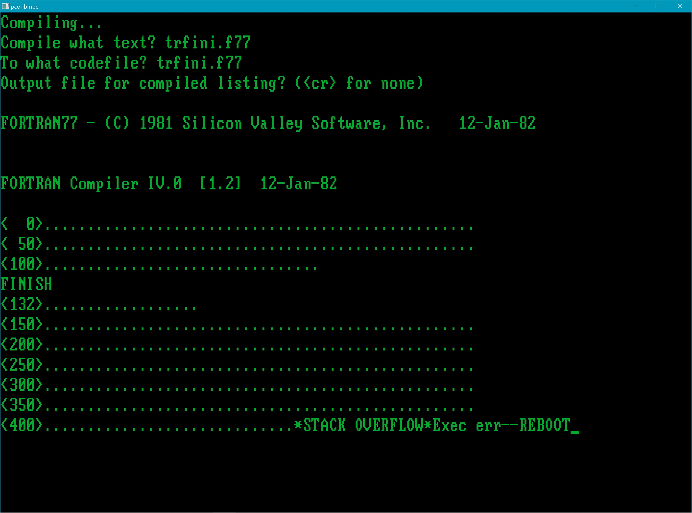
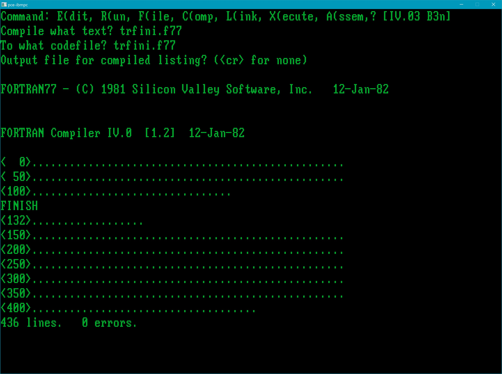

## Rebuilding the entire "Super Star Trek" game from source

This process assumes that you have the ucsd-psystem-fs tools (from https://github.com/jdykstra/ucsd-psystem-fs) installed and built on a Linux system (say, in ~/ucsd-psystem-fs-master). You should also have downloaded this GitHub archive and extracted the Zip file on a Windows system (say, into directory D:\UCSD_p-Trek), and have copied (via scp or a similar file-transfer program) the following files from Windows in D:\UCSD_p-Trek\source\ucsd-psystem-fs_tools to your Linux system into a working directory (say, ~/ucsd_p-trek):

####
    comp1a1.text
    comp1a2.text
    comp1b1.text
    comp1b2.text
    decode
    encode
    lib3a.text
    lib3b.text
    listx
    mkfx
    putcomp1a1
    putcomp1a2
    putcomp1b1
    putcomp1b2
    putinst
    putlibs
    putpas
    putx
    XFER.ima

It also assumes that you have PCE installed on Windows (say, in D:\PCE), have created the configuration file D:\PCE\pce-trek.cfg and configuration include file D:\PCE\data\pce-trek.inc . You will be making (temporary) modifications to pce-trek.inc during the course of the rebuild to change, add, and remove floppy images. You also should have copied **all** the disk images provided here to D:\PCE (normally only the first three are needed just to play the game; the others are only required for this rebuild process):

from D:\UCSD_p-Trek\disk_images

####
    TREK3A.ima
    TREK3B.ima
    TRTREK.ima

from D:\UCSD_p-Trek\source\build_disk_images

####
    BOOT2F2.ima
    BOOT2P2.ima
    COMP1A1.ima
    COMP1A2.ima
    COMP1B1.ima
    COMP1B2.ima
    TREK2A.ima
    TREK2B.ima
    UTILF2.ima
    XFER.ima

The Fortran 77 source files are partitioned into 4 source-code sets (1A1, 1A2, 1B1 and 1B2 -- there were originally just two sets 1A and 1B, but they had to be further subdivided as the collection got bigger). These sets are transferred (via XFER.ima) to and compiled (on the p-System) on four separate floppy volumes (COMP1A1:, COMP1A2:, COMP1B1:, and COMP1B2 -- the floppies each must have enough room to hold the source files **and** their corresponding object files). Following compilation, the object code is copied to two volumes (object files from COMP1A1: and COMP1A2: go to TREK2A:, and object files from COMP1B1: and COMP1B2: go to TREK2B:) 

Finally, with all the object code mounted on volumes TREK2A: and TREK2B:, the object libraries are created (one volume at a time) on TREK3A: and TREK3B: .

All the compilation and library creation is performed by means of **scripts** (which, in the p-System, are simply keystroke files). Each of the script files:

####
    comp1a1.text
    comp1a2.text
    comp1b1.text
    comp1b2.text

is placed (in turn, by shell script "~/ucsd_p-trek/putcomp1a1", etc., running on Linux) on the **single-sided** (160KB) "transfer" floppy image XFER.ima, along with the source code in set 1A1 (or 1A2, etc.), which is then scp'ed to D:\PCE on Windows, finally to be mounted on the p-System and transferred to volume COMP1A1: (COMP1A2:, etc.)

The library-creation script files:

####
    lib3a.text
    lib3b.text

have already been placed on the boot volume BOOT2F2:

The two Pascal source files are handled as a "special case".

The entire process is rather tedious and error-prone, but is greatly facilitated by the existence of p-System scripts. See the "p-System Users' Guide", p. 2-22 (p. 124 in the PDF) heading "Monitor". It isn't actually necessary to use "M(on"itor to create a script; you can just use a text editor to create such a script file (though the resulting text file must be "encode"d via ucsdpsys_text, on Linux, before being placed on XFER.ima for transfer to the p-System -- the provided Linux shell scripts you will copy to "~/ucsd_p-trek" will do this automatically).

## Populating COMP1A1.ima and COMP1A2.ima with source code and compile scripts

####
    On Windows, in the source code directory you've downloaded from this
    repository (to, say, D:\UCSD_p-Trek\source\UCSD_p-System_code),
    create an archive containing all the p-System Fortran 77 (and Pascal)
    "Super Star Trek" source code:
    tar cvf trek.tar TR*.TREK
    (or use your favorite archiver: Zip, etc.)
    
    Copy the source-code archive to your working directory
    on Linux (containing the ucsd-psystem-fs_tools shell scripts
    and the p-System compile scripts), e.g.:
    scp trek.tar user@192.168.1.x:/home/user/ucsd_p-trek/
    
    On Linux, in ~/ucsd_p-trek (or whatever you're calling your
    working directory containing the ucsd-psystem-fs_tools shell scripts),
    extract the source-code archive:
    tar xvf trek.tar
    
    (Still on Linux, in ~/ucsd_p-trek) put the 1A1 source-code set
    (plus p-System script comp1a1.text) on XFER.ima
    by running shell script:
    ./putcomp1a1
    
    On Windows, in the PCE directory (D:\PCE, or whatever
    you've called it), grab the XFER: volume containing the 1A1
    source-code set plus the comp1a1.text script from Linux):
    scp .../ucsd_p-trek/XFER.ima .
    
    On Windows, edit the configuration include file
    D:\PCE\data\pce-trek.inc to use the following
    floppy configuration:
    floppy1: BOOT2F2.ima
    floppy2: COMP1A1.ima
    floppy3: COMP1A2.ima
    floppy4: XFER.ima   (h=1)
    (Do not neglect to change the h=1 or h=2 line
    when switching from a double-side floppy to
    a single-sided floppy or vice versa!)
    
    On Windows, in the D:\PCE directory:
    run-trek
    
    Initialize the COMP1A1: and COMP1A2: volumes:

    From the p-System Command Menu:
    fzCOMP1A1:       (zero COMP1A1:)
    Destroy COMP1A1: ? y
    Duplicate dir ? n
    Are there 640 blks on the disk ? (Y/N) y
    New vol name ? COMP1A1:
    COMP1A1: correct ? y
    COMP1A1: zeroed
    
    From the p-System Command Menu:
    zCOMP1A2:       (zero COMP1A2:)
    Destroy COMP1A2: ? y
    Duplicate dir ? n
    Are there 640 blks on the disk ? (Y/N) y
    New vol name ? COMP1A2:
    COMP1A2: correct ? y
    COMP1A2: zeroed

    Copy the 1A1 source-code set (and the corresponding
    compile script) from XFER: to COMP1A1:.
    (This will be repeated with COMP1A2: after putting
    the 1A2 source-code set and the corresponding
    compile script on the XFER: floppy.)
    
    t
    Transfer what file ? XFER:?
    To where ? COMP1A1:?
    Transfer TREKCO.F77.TEXT ? y
    XFER:TREKCO.F77.TEXT    --> COMP1A1:TREKCO.F77.TEXT
    Transfer TRTREK.F77.TEXT ? y
    XFER:TRTREK.F77.TEXT    --> COMP1A1:TRTREK.F77.TEXT
    . . .
    Transfer TRCROP.F77.TEXT ? y
    XFER:TRCROP.F77.TEXT    --> COMP1A1:TRCROP.F77.TEXT
    Transfer COMP1A1.TEXT ? y
    XFER:COMP1A1.TEXT    --> COMP1A1:COMP1A1.TEXT
    
    qh  (Halt p-System)
    close PCE window
    
    On Linux, in ~/ucsd_p-trek (ucsd-psystem-fs_tools scripts directory):
    
    ./putcomp1a2
    
    On Windows, in the D:\PCE directory:
    scp .../ucsd_p-trek/XFER.ima .
    
    (PCE\data\pce-trek.inc floppy configuration same as above)
    
    On Windows, in D:\PCE directory:
    run-trek
    
    From p-System Command Menu:
    ft
    Transfer what file ? XFER:?
    To where ? COMP1A2:?
    Transfer TREKCO.F77.TEXT ? y
    XFER:TREKCO.F77.TEXT    --> COMP1A2:TREKCO.F77.TEXT
    Transfer TRSETU.F77.TEXT ? y
    XFER:TRSETU.F77.TEXT    --> COMP1A2:TRSETU.F77.TEXT
    . . .
    Transfer TRJA.F77.TEXT ? y
    XFER:TRJA.F77.TEXT    --> COMP1A2:TRJA.F77.TEXT
    Transfer COMP1A2.TEXT ? y
    XFER:COMP1A2.TEXT    --> COMP1A2:COMP1A2.TEXT
    
    qh  (Halt p-System)
    close PCE window

## Populating COMP1B1.ima and COMP1B2.ima with source code and compile scripts

This mirrors the process described above for COMP1A1: and COMP1A2:,
now applied to COMP1B1: and COMP1B2:

####
    On Linux, in ~/ucsd_p-trek (the ucsd-psystem-fs_tools scripts directory):
    ./putcomp1b1
    
    On Windows, in D:\PCE directory:
    scp .../ucsd_p-trek/XFER.ima .
    
    On Windows, edit the configuration include file
    D:\PCE\data\pce-trek.inc to use the following
    floppy configuration:
    floppy1: BOOT2F2.ima
    floppy2: COMP1B1.ima
    floppy3: COMP1B2.ima
    floppy4: XFER.ima   (h=1)
    
    On Windows, in D:\PCE directory:
    run-trek
    
    In p-System Filer:
    fzCOMP1B1:       (zero COMP1B1:)
    Destroy COMP1B1: ? y
    Duplicate dir ? n
    Are there 640 blks on the disk ? (Y/N) y
    New vol name ? COMP1B1:
    COMP1B1: correct ? y
    COMP1B1: zeroed
    
    zCOMP1B2:       (zero COMP1B2:)
    Destroy COMP1B2: ? y
    Duplicate dir ? n
    Are there 640 blks on the disk ? (Y/N) y
    New vol name ? COMP1B2:
    COMP1B2: correct ? y
    COMP1B2: zeroed
    
    t
    Transfer what file ? XFER:?
    To where ? COMP1B1:?
    Transfer TREKCO.F77.TEXT ? y
    XFER:TREKCO.F77.TEXT    --> COMP1B1:TREKCO.F77.TEXT
    Transfer TRCRAS.F77.TEXT ? y
    XFER:TRCRAS.F77.TEXT    --> COMP1B1:TRCRAS.F77.TEXT
    . . .
    Transfer TRGETC.F77.TEXT ? y
    XFER:TRGETC.F77.TEXT    --> COMP1B1:TRGETC.F77.TEXT
    Transfer COMP1B1.TEXT ? y
    XFER:COMP1B1.TEXT    --> COMP1B1:COMP1B1.TEXT
    
    qh  (Halt p-System)
    close PCE window
    
    On Linux, in ~/ucsd_p-System (ucsd-psystem-fs_tools scripts directory):
    ./putcomp1b2
    
    In D:\PCE directory:
    scp .../ucsd_p-trek/XFER.ima .
    
    (Floppy configuration in D:\PCE\data\pce-trek.inc
    same as above)
    
    On Windows, in D:\PCE directory:
    run-trek
    
    In p-System Filer:
    ft
    Transfer what file ? XFER:?
    To where ? COMP1B2:?
    Transfer TREKCO.F77.TEXT ? y
    XFER:TREKCO.F77.TEXT    --> COMP1B2:TREKCO.F77.TEXT
    Transfer TRATTA.F77.TEXT ? y
    XFER:TRATTA.F77.TEXT    --> COMP1B2:TRATTA.F77.TEXT
    . . .
    Transfer TREMEX.F77.TEXT ? y
    XFER:TREMEX.F77.TEXT    --> COMP1B2:TREMEX.F77.TEXT
    Transfer COMP1B2.TEXT ? y
    XFER:COMP1B2.TEXT    --> COMP1B2:COMP1B2.TEXT
    
    qh  (Halt p-System)
    close PCE window

Each of the populated source volumes COMP1A1:, COMP1A2:. COMP1B1:, and COMP1B2 must now be compiled, one at a time, with the COMP\*.ima floppy image attached (in PCE) to floppy drive #4 (p-System volume #10) and the (pre-existing) object-code sets on TREK2A.ima and TREK2B.ima attached (in PCE) to floppy drives #2 (p-System volume #5) and #3 (p-System volume #9), respectively. The boot drive (PCE floppy drive #1, p-System volume #4) is BOOT2F2.ima in all cases.

## Compiling the source files on COMP1A1.ima

####
    On Windows, edit the configuration include file
    D:\PCE\data\pce-trek.inc to use the following
    floppy configuration:
    floppy1: BOOT2F2.ima
    floppy2: TREK2A.ima
    floppy3: TREK2B.ima
    floppy4: COMP1A1.ima   (h=2 !)
    
    On Windows, in D:\PCE directory:
    run-trek
    
    From p-System Command Menu:
    x
    Execute what file? i=COMP1A1:COMP1A1.TEXT
    Compiling...
    (This should complete without any errors.
    If you hear a beep, that's bad news!)
    
    h  (Halt p-System)
    close PCE window

## Compiling the source files on COMP1A2.ima

####
    On Windows, edit the configuration include file
    D:\PCE\data\pce-trek.inc to use the following
    floppy configuration:
    floppy1: BOOT2F2.ima
    floppy2: TREK2A.ima
    floppy3: TREK2B.ima
    floppy4: COMP1A2.ima   (h=2 !)
    
    On Windows, in D:\PCE directory:
    run-trek
    
    From p-System Command Menu:
    x
    Execute what file? i=COMP1A2:COMP1A2.TEXT
    Compiling...
    (This should complete without any errors.
    If you hear a beep, that's bad news!)
    
    h  (Halt p-System)
    close PCE window

## Compiling the source files on COMP1B1.ima

####
    On Windows, edit the configuration include file
    D:\PCE\data\pce-trek.inc to use the following
    floppy configuration:
    floppy1: BOOT2F2.ima
    floppy2: TREK2A.ima
    floppy3: TREK2B.ima
    floppy4: COMP1B1.ima   (h=2 !)
    
    In D:\PCE directory:
    run-trek

The next step, while seemingly superfluous, for some reason prevents a stack overflow from occurring during the subsequent compile -- of TRFINI.F77.TEXT, in particular:

NOTE: This "stack overflow" **only** seems to occur when a large source file (such as TRFINI.F77.TEXT) is compiled by means of a script. To avoid this failure, before running the COMP1B1:COMP1B1.TEXT, run the Filer from the p-System Command Menu, and simply list the COMP1B1: volume:

####
    fl
    Dir listing of what vol ? comp1b1:
    Type <space> to continue
    COMP1B1:
    TREKCO.F77.TEXT    10 25-Apr-25
    TRCRAS.F77.TEXT     6 25-Apr-25
    . . .
    TRGETC.F77.TEXT    10 25-Apr-25
    COMP1B1.TEXT        4 25-Apr-25
    25/25 files<listed/in-dir>, 186 blocks used, 454 unused, 454 in largest

Now the 1B1 code can be compiled without error (and I have no idea why, but it's fortunate that this workaround works reliably):

####
    qx
    Execute what file? i=COMP1B1:COMP1B1.TEXT
    Compiling...
    (This should **now** complete without any errors.
    If you hear a beep, you probably skipped the above step!)

####
    h  (Halt p-System)
    close PCE window

## Compiling the source files on COMP1B2.ima

####
    On Windows, edit the configuration include file
    D:\PCE\data\pce-trek.inc to use the following
    floppy configuration:
    floppy1: BOOT2F2.ima
    floppy2: TREK2A.ima
    floppy3: TREK2B.ima
    floppy4: COMP1B2.ima   (h=2 !)
    
    On Windows, in PCE directory:
    run-trek
    
    In p-System:
    x
    Execute what file? i=COMP1B2:COMP1B2.TEXT
    Compiling...
    (This should complete without any errors.
    If you hear a beep, that's bad news!)
    
    h  (Halt p-System)
    close PCE window

Now we copy the object code from COMP1A1: and COMP1A2: to TREK2A:, and from COMP1B1: and COMP1B2: to TREK2B:, respectively.

## Initializing TREK2A: and TREK2B:

####
    On Windows, edit the configuration include file
    D:\PCE\data\pce-trek.inc to use the following
    floppy configuration:
    floppy1: BOOT2F2.ima
    floppy2: TREK2A.ima
    floppy3: TREK2B.ima
    floppy4: COMP1A1.ima   (h=2 !)
    
    From p-System Command Menu:
    fzTREK2A:       (zero TREK2A:)
    Destroy TREK2A: ? y
    Duplicate dir ? n
    Are there 640 blks on the disk ? (Y/N) y
    New vol name ? TREK2A:
    TREK2A: correct ? y
    TREK2A: zeroed
    
    zTREK2B:       (zero TREK2B:)
    Destroy TREK2B: ? y
    Duplicate dir ? n
    Are there 640 blks on the disk ? (Y/N) y
    New vol name ? TREK2B:
    TREK2B: correct ? y
    TREK2B: zeroed

## Transfer object code from COMP1A1: to TREK2A:

####
    (Floppy configuration in D:\PCE\data\pce-trek.inc
    same as above)

    t
    Transfer what file ? COMP1A1:?.CODE
    To where ? TREK2A:?.CODE
    Transfer TRTREK.F77.CODE ? y
    COMP1A1:TRTREK.F77.CODE    --> TREK2A:TRTREK.F77.CODE
    Transfer TRKICK.F77.CODE ? y
    COMP1A1:TRKICK.F77.CODE    --> TREK2A:TRKICK.F77.CODE
    . . .
    Transfer TRSCAN.F77.CODE ? y
    COMP1A1:TRSCAN.F77.CODE    --> TREK2A:TRSCAN.F77.CODE
    Transfer TRCROP.F77.CODE ? y
    COMP1A1:TRCROP.F77.CODE    --> TREK2A:TRCROP.F77.CODE
    
    qh  (Halt p-System)
    close PCE window

## Transfer object code from COMP1A2: to TREK2A:

####
    On Windows, edit the configuration include file
    D:\PCE\data\pce-trek.inc to use the following
    floppy configuration:
    floppy1: BOOT2F2.ima
    floppy2: TREK2A.ima
    floppy3: TREK2B.ima
    floppy4: COMP1A2.ima   (h=2 !)
    
    On Windows, in D:\PCE directory:
    run-trek
    
    From p-System Command Menu:
    ft
    Transfer what file ? COMP1A2:?.CODE
    To where ? TREK2A:?.CODE
    Transfer TRSETU.F77.CODE ? y
    COMP1A2:TRSETU.F77.CODE    --> TREK2A:TRSETU.F77.CODE
    Transfer TREXPR.F77.CODE ? y
    COMP1A2:TREXPR.F77.CODE    --> TREK2A:TREXPR.F77.CODE
    . . .
    Transfer TRSRSC.F77.CODE ? y
    COMP1A2:TRSRSC.F77.CODE    --> TREK2A:TRSRSC.F77.CODE
    Transfer TRJA.F77.CODE ? y
    COMP1A2:TRJA.F77.CODE    --> TREK2A:TRJA.F77.CODE
    
    qh  (Halt p-System)
    close PCE window

## Transfer object code from COMP1B1: to TREK2B:

####
    On Windows, edit the configuration include file
    D:\PCE\data\pce-trek.inc to use the following
    floppy configuration:
    floppy1: BOOT2F2.ima
    floppy2: TREK2A.ima
    floppy3: TREK2B.ima
    floppy4: COMP1B1.ima   (h=2 !)
    
    On Windows, in D:\PCE directory:
    run-trek
    
    From p-System Command Menu:
    ft
    Transfer what file ? COMP1B1:?.CODE
    To where ? TREK2B:?.CODE
    Transfer TRCRAS.F77.CODE ? y
    COMP1B1:TRCRAS.F77.CODE    --> TREK2B:TRCRAS.F77.CODE
    Transfer TRCRAF.F77.CODE ? y
    COMP1B1:TRCRAF.F77.CODE    --> TREK2B:TRCRAF.F77.CODE
    . . .
    Transfer TRIMPU.F77.CODE ? y
    COMP1B1:TRIMPU.F77.CODE    --> TREK2B:TRIMPU.F77.CODE
    Transfer TRGETC.F77.CODE ? y
    COMP1B1:TRGETC.F77.CODE    --> TREK2B:TRGETC.F77.CODE
    
    qh  (Halt p-System)
    close PCE window

## Transfer object code from COMP1B2: to TREK2B:

####
    On Windows, edit the configuration include file
    D:\PCE\data\pce-trek.inc to use the following
    floppy configuration:
    floppy1: BOOT2F2.ima
    floppy2: TREK2A.ima
    floppy3: TREK2B.ima
    floppy4: COMP1B2.ima   (h=2 !)
    
    In D:\PCE directory:
    run-trek
    
    From p-System Command Menu:
    ft
    Transfer what file ? COMP1B2:?.CODE
    To where ? TREK2B:?.CODE
    Transfer TRATTA.F77.CODE ? y
    COMP1B2:TRATTA.F77.CODE    --> TREK2B:TRATTA.F77.CODE
    Transfer TREVEN.F77.CODE ? y
    COMP1B2:TREVEN.F77.CODE    --> TREK2B:TREVEN.F77.CODE
    . . .
    Transfer TRHELP.F77.CODE ? y
    COMP1B2:TRHELP.F77.CODE    --> TREK2B:TRHELP.F77.CODE
    Transfer TREMEX.F77.CODE ? y
    COMP1B2:TREMEX.F77.CODE    --> TREK2B:TREMEX.F77.CODE
    
    qh  (Halt p-System)
    close PCE window

## Handle the special case of the two Pascal source files

####
    On Linux, in ~/ucsd_p-System (ucsd-psystem-fs_tools scripts directory):
    ./putpas
    
    On Windows, in D:\PCE directory:
    scp .../ucsd_p-trek/XFER.ima .

    On Windows, edit the configuration include file
    D:\PCE\data\pce-trek.inc to use the following
    floppy configuration:
    floppy1: BOOT2P2.ima        Boot disk with Pascal compiler!
    floppy2: TREK2A.ima
    floppy3: TREK2B.ima
    floppy4: XFER.ima   (h=1 !)
    
    On Windows, in D:\PCE directory:
    run-trek
    
    From p-System Command Menu:
    fp
    Prefix titles by what vol ? XFER:
    Prefix is XFER:
    qc
    Compiling...
    Compile what text? TRRANF.PAS
    To what codefile? TREK2A:TRRANF.PAS
    Output file for compiled listing? (<cr> for none) <CR>
    Pascal compiler - release level IV.0 c3.as-2
    . . .
    c
    Compiling...
    Compile what text? TRDATE.PAS
    To what codefile? TREK2A:TRDATE.PAS
    Output file for compiled listing? (<cr> for none) <CR>
    Pascal compiler - release level IV.0 c3.as-2
    . . .
    
    h  (Halt p-System)
    close PCE window

## Create TREK3A: library volume

####
    On Windows, edit the configuration include file
    D:\PCE\data\pce-trek.inc to use the following
    floppy configuration:
    floppy1: BOOT2F2.ima        Boot disk with Fortran compiler (and lib3a.text, lib3b.text scripts)
    floppy2: TREK2A.ima
    floppy3: TREK2B.ima
    floppy4: TREK3A.ima   (h=2 !)
    
    On Windos, in D:\PCE directory:
    run-trek
    
    From p-System Command Menu:
    fzTREK3A:       (zero TREK3A:)
    Destroy TREK3A: ? y
    Duplicate dir ? n
    Are there 640 blks on the disk ? (Y/N) y
    New vol name ? TREK3A:
    TREK3A: correct ? y
    TREK3A: zeroed
    
    qx
    Execute what file? i=BOOT2F2:lib3a.text
    Library...
    (This should complete without any errors.
    If you hear a beep, that's bad news!)
    
    h  (Halt p-System)
    close PCE window

## Create TREK3B: library volume

####
    On Windows, edit the configuration include file
    D:\PCE\data\pce-trek.inc to use the following
    floppy configuration:
    floppy1: BOOT2F2.ima
    floppy2: TREK2A.ima
    floppy3: TREK2B.ima
    floppy4: TREK3B.ima   (h=2 !)
    
    On Windows, in D:\PCE directory:
    run-trek
    
    From p-System Command Menu:
    fzTREK3B:       (zero TREK3B:)
    Destroy TREK3B: ? y
    Duplicate dir ? n
    Are there 640 blks on the disk ? (Y/N) y
    New vol name ? TREK3B:
    TREK3B: correct ? y
    TREK3B: zeroed
    
    qx
    Execute what file? i=BOOT2F2:lib3b.text
    Library...
    (This should complete without any errors.
    If you hear a beep, that's bad news!)
    
    h  (Halt p-System)
    close PCE window

The game can now run using the BOOT2F2: (Fortran) boot disk using the following PCE floppy configuration:

####
    On Windows, edit the configuration include file
    D:\PCE\data\pce-trek.inc to use the following
    floppy configuration:
    floppy1: BOOT2F2.ima
    floppy2: TREK3A.ima
    floppy3: TREK3B.ima
    floppy4: TREK2A.ima   (h=2 !)
    
    On Windows, in D:\PCE directory:
    run-trek
    
    From p-System Command Menu:
    x
    Execute what file? trek2a:trtrek.f77
    ** U.T. "SUPER" STAR TREK **
    ADAPTED FOR VAX/VMS BY MK
    . . .

## Recreating TRTREK:

####
    To recreate TRTREK.ima from the newly-compiled code (which
    includes a rebuilt TRTREK.F77.CODE main program),
    perform the following:

    On Windows, edit the configuration include file
    D:\PCE\data\pce-trek.inc to use the following
    floppy configuration:
    floppy1: TRTREK.ima
    floppy2: TREK3A.ima
    floppy3: TREK3B.ima
    floppy4: TREK2A.ima   (h=2 !)
    
    On Windows, in D:\PCE directory:
    run-trek

    Exit the game. One quick way of doing this is to select a "FROZEN" game
    and then to specify a nonexistent freeze file. You'll get the:
        IO error: file not found
        Segment RTIO    Proc# 28    Offset# 111
        Type <space> to continue
    When you type the <space>, you'll be at the Command Menu.
    
    Then run the Filer from p-System Command Menu:
    ft
    Transfer what file ? TREK2A:TRTREK.F77.CODE
    To where ? TRTREK:SYSTEM.STARTUP
    Remove old TRTREK:SYSTEM.STARTUP ? y
    TREK2A:TRTREK.F77.CODE   --> TRTREK:SYSTEM.STARTUP

    qh  (Exit the Filer and halt p-System)
    close PCE window

    At this point, you will have reduced the size of the 121-block "hole"
    at the beginning of TRTREK: If you want to reestablish the full 121-block
    gap at the beginning of TRTREK: (recommended, I suppose),
    the procedure is the same as that described in ../README\.md,
    which is repeated here.

    You'll need to create a blank ("Z(ero"ed) volume (called, let's say, "WORK:").

    Attach this blank volume to PCE.
    On Windows, edit the configuration include file
    D:\PCE\data\pce-trek.inc to use the following
    floppy configuration:
    floppy1: TRTREK.ima
    floppy2: TREK3A.ima
    floppy3: TREK3B.ima
    floppy4: WORK.ima   (h=2 !)
    
    On Windows, in D:\PCE directory:
    run-trek

    Exit the game, as described above.

    From the p-System Command Menu, use the Filer to copy all the
    contents of TRTREK: to WORK:
    ft
    Transfer what file ? TRTREK:?
    To where ? WORK:?
    Transfer SYSTEM.STARTUP ? y
    TRTREK:SYSTEM.STARTUP      --> WORK:SYSTEM.STARTUP
    Transfer SYSTEM.PASCAL ? y
    TRTREK:SYSTEM.PASCAL       --> WORK:SYSTEM.PASCAL
    . . .
    Transfer STRTRK.TEXT ? y
    TRTREK:STRTRK.TEXT         --> WORK:STRTRK.TEXT

    Now "Z(ero" the TRTREK: volume.

    From the Filer:
    zTRTREK:       (zero TRTREK:)
    Destroy TRTREK: ? y
    Duplicate dir ? n
    Are there 640 blks on the disk ? (Y/N) y
    New vol name ? TRTREK:
    TRTREK: correct ? y
    TRTREK: zeroed

    Now, "reserve" the 121-block "hole" at the beginning of TRTREK: by
    "T(rans"ferring SYSTEM.PASCAL from WORK: to TRTREK: and naming it,
    e.g., "HOLE" on the latter:

    From the Filer:
    t
    Transfer what file ? WORK1:SYSTEM.PASCAL
    To where ? TRTREK:HOLE
    WORK:SYSTEM.PASCAL         --> TRTREK:HOLE

    Now, "T(rans"fer **everything** from WORK: (including SYSTEM.PASCAL
    as itself) to TRTREK: 

    From the Filer:
    t
    Transfer what file ? WORK:?
    To where ? TRTREK:?
    Transfer SYSTEM.STARTUP ? y
    WORK:SYSTEM.STARTUP        --> TRTREK:SYSTEM.STARTUP
    Transfer SYSTEM.PASCAL ? y
    WORK:SYSTEM.PASCAL         --> TRTREK:SYSTEM.PASCAL
    . . .
    Transfer STRTRK.TEXT ? y
    WORK:STRTRK.TEXT           --> TRTREK:STRTRK.TEXT

    Finally, remove "HOLE" from TRTREK:

    From the Filer:
    r
    Remove what file ?
    TRTREK:HOLE
    TRTREK:HOLE                --> removed
    Update directory ? y

    A gap will have been created that precedes all the other contents of
    TRTREK:, ensuring that the game will run properly.

